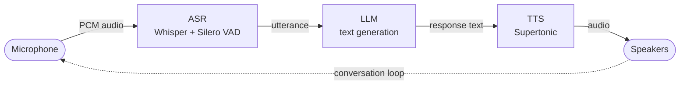

## Overview

A voice assistant chains three AI capabilities into a continuous conversation loop:



Compared to using each capability individually, the key differences are:
- You need to coordinate **three model loads** simultaneously (Whisper + VAD, LLM, and TTS bundle) — they all stay loaded for the duration of the session.
- VAD parameters need **conservative tuning** to avoid the assistant transcribing its own TTS output (self-hearing feedback loop).
- You should **gate the microphone during TTS playback** and apply a short post-playback cooldown so room reverb doesn't bleed into the next utterance.
- You should **filter short or non-linguistic transcripts** (e.g. `"."`, `"[BLANK_AUDIO]"`) since Whisper hallucinates them from near-silent audio.

## Functions

Use the following sequence of function calls:
1. [`loadModel()`](/reference/api#loadmodel) three times — once per `modelType` (`"whisper"`, `"llm"`, `"tts"`).
2. [`transcribeStream()`](/reference/api#transcribestream) — open a streaming session that emits utterances on VAD-detected pauses.
3. [`completion()`](/reference/api#completion) — generate a response from the rolling conversation history (streamed).
4. [`textToSpeech()`](/reference/api#texttospeech) — synthesize the response into a PCM buffer.
5. [`unloadModel()`](/reference/api#unloadmodel) for each loaded model on shutdown.

For how to use each function, see [SDK — API reference](/reference/api/).

## Models

You load four model bundles in total:
- A `qvac-ext-lib-whisper.cpp`-compatible model for transcription, plus a Silero VAD model.
- A `llama.cpp`-compatible LLM for response generation.
- A Supertonic TTS bundle (text encoder, duration predictor, vector estimator, vocoder, unicode indexer, config, and voice style).

Recommended defaults (used in the example below):

| Stage | Model |
| --- | --- |
| ASR | `WHISPER_TINY` |
| VAD | `VAD_SILERO_5_1_2` |
| LLM | `LLAMA_3_2_1B_INST_Q4_0` |
| TTS | Supertonic2 (English) |

For models available as constants, see [SDK — Models](/introduction#models).

## Example

This example is **desktop-only**. Mobile (React Native / Expo) needs a different audio path and isn't covered here.

### Requirements

- **FFmpeg** (with `ffplay`) on `PATH` — `ffmpeg` captures mic audio, `ffplay` plays back TTS output.
- **Microphone** access (on macOS, the running shell needs mic permission in *System Settings → Privacy & Security → Microphone*).
- **Speakers** connected and selected as the default output device.

<Accordions type="multiple">
<Accordion title="Installing FFmpeg">
  | Platform | Command |
| --- | --- |
| macOS (Homebrew) | `brew install ffmpeg` |
| Debian / Ubuntu | `sudo apt update && sudo apt install ffmpeg` |
| Fedora / RHEL | `sudo dnf install ffmpeg` (enable [RPM Fusion](https://rpmfusion.org/Configuration) first if needed) |
| Arch Linux | `sudo pacman -S ffmpeg` |

Verify the install with:

```bash
ffmpeg -version
```
</Accordion>

<Accordion title="Selecting a microphone">
By default the example uses the system default mic on each OS:
- **macOS:** AVFoundation audio device `:0`.
- **Linux:** PulseAudio source `default`.

To use a different mic, set the `MIC_DEVICE` environment variable:

```bash
# macOS — pick by index (list with `ffmpeg -f avfoundation -list_devices true -i ""`)
MIC_DEVICE=":1" bun run examples/voice-assistant/voice-assistant.ts

# Linux — pick a PulseAudio source (list with `pactl list short sources`)
MIC_DEVICE="alsa_input.usb-Blue_Microphones_Yeti-00" \
  bun run examples/voice-assistant/voice-assistant.ts
```
</Accordion>
</Accordions>

### Running it

The following script implements the full loop with VAD tuning, mic gating during playback, and short-utterance filtering:

<Tabs>
<Tab value="js" label="JavaScript" default>
<WrapCode>

```js file=<rootDir>/packages/sdk/dist/examples/voice-assistant/voice-assistant.js title="voice-assistant.js" lineNumbers
```
</WrapCode>
</Tab>

<Tab value="ts" label="TypeScript">
<WrapCode>

```ts file=<rootDir>/packages/sdk/examples/voice-assistant/voice-assistant.ts title="voice-assistant.ts" lineNumbers
```
</WrapCode>
</Tab>
</Tabs>

Speak into the mic; transcriptions and the assistant's spoken responses will follow. Press `Ctrl+C` to quit. Models are downloaded on first run (~1 GB total) and cached locally; subsequent runs work fully offline.

### Tuning

The defaults are deliberately conservative to prevent the assistant from hearing its own TTS output and looping on itself (a classic failure mode when mic and speakers share the same room). The relevant VAD parameters in the script:

```ts
{
  threshold: 0.6,              // less sensitive than Silero's default
  min_speech_duration_ms: 300, // drops short clicks / breaths / stray words
  min_silence_duration_ms: 700,// long quiet tail before committing a segment
  max_speech_duration_s: 15.0, // caps runaway utterances
  speech_pad_ms: 200,          // edge padding improves accuracy
}
```

Plus three additional safeguards:

- **Mic gate during TTS:** incoming audio is dropped while the assistant speaks, so it cannot transcribe its own output.
- **Post-playback cooldown** (`POST_PLAYBACK_COOLDOWN_MS = 300`): keeps the mic gated for a moment after playback so speaker/room reverb doesn't bleed into the next VAD segment.
- **Minimum utterance length** (`MIN_UTTERANCE_CHARS = 3`): drops single-character or two-letter phantom transcripts like `"you"` or `"."` that Whisper hallucinates from near-silent audio.

### Troubleshooting

If you run into common issues, adjust the values above:

| Symptom | Fix |
| --- | --- |
| Assistant cuts you off mid-sentence | Raise `min_silence_duration_ms` to `900-1000` |
| Assistant talks over itself / loops forever | Raise `threshold` to `0.7`; raise `min_silence_duration_ms` to `900`; raise `POST_PLAYBACK_COOLDOWN_MS` to `500` |
| Slow to respond after you stop talking | Lower `min_silence_duration_ms` to `500` |
| Picks up background typing / keyboard | Raise `threshold` to `0.7` and `min_speech_duration_ms` to `400` |
| Short commands ("yes", "no") are ignored | Lower `MIN_UTTERANCE_CHARS` to `2` |

If you're running with headphones (mic cannot hear the speaker), you can loosen everything: `threshold: 0.5`, `min_silence_duration_ms: 500`, `POST_PLAYBACK_COOLDOWN_MS: 0`.

### Customizing

- **Different ASR model:** swap `WHISPER_TINY` for a larger Whisper model for better transcription accuracy (e.g. `WHISPER_BASE_Q8_0`, `WHISPER_SMALL_Q8_0`, `WHISPER_LARGE_V3_TURBO`, etc.).
- **Different LLM:** swap `LLAMA_3_2_1B_INST_Q4_0` for any LLM constant from `@qvac/sdk`. Larger models give better answers at the cost of latency.
- **Different voice:** replace the Supertonic constants with another TTS model (e.g. Chatterbox — see [Text-to-Speech](/ai-capabilities/text-to-speech)).
- **System prompt:** edit `SYSTEM_PROMPT` at the top of the script. The default instructs the LLM to be concise and avoid markdown so responses are pleasant to listen to.

<Callout type="success">
**Tip:** all examples throughout this documentation are self-contained and runnable. For instructions on how to run them, see [SDK quickstart](/quickstart).
</Callout>
