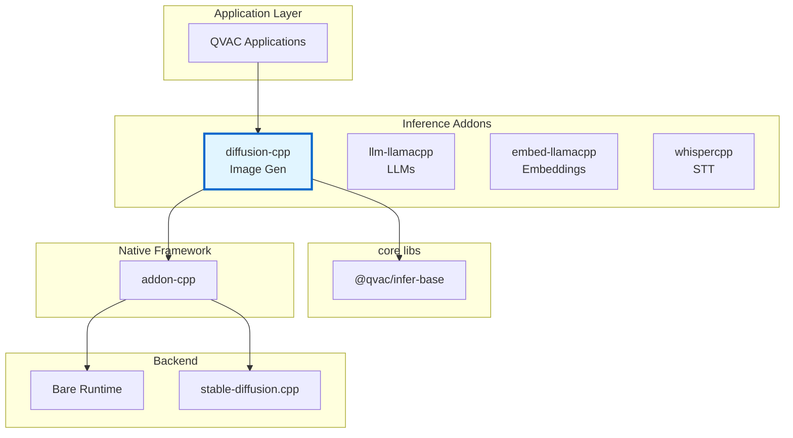
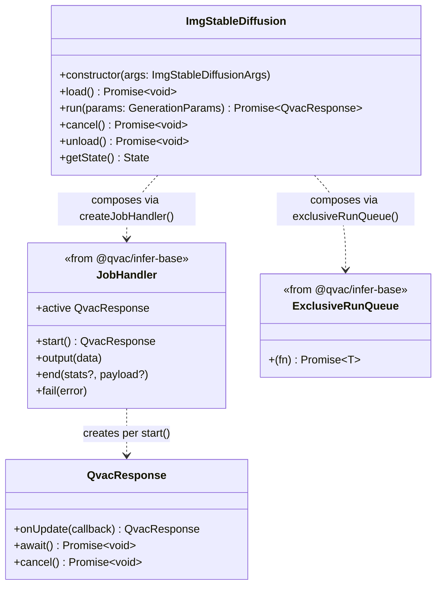
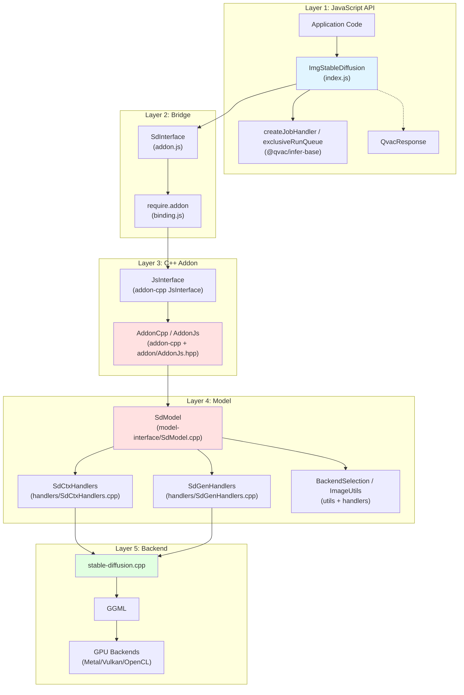
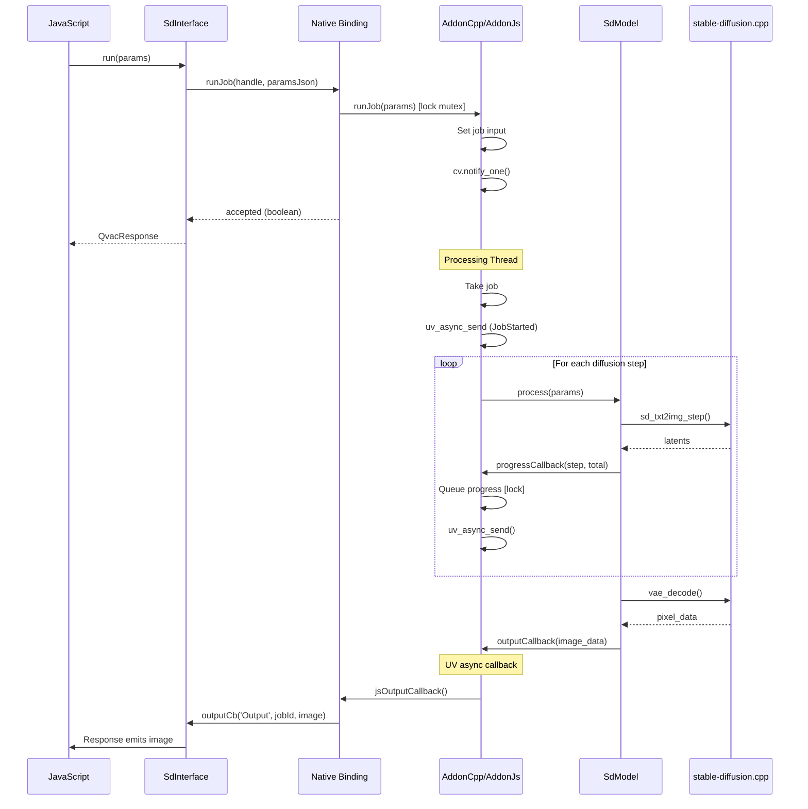

# Architecture Documentation

**Package:** `@qvac/diffusion-cpp` v0.6.0
**Stack:** JavaScript, C++20, stable-diffusion.cpp, Bare Runtime, CMake, vcpkg
**License:** Apache-2.0

---

## Table of Contents

### Overview
- [Purpose](#purpose)
- [Key Features](#key-features)
- [Target Platforms](#target-platforms)

### Core Architecture
- [Package Context](#package-context)
- [Public API](#public-api)
- [Internal Architecture](#internal-architecture)
- [Core Components](#core-components)
- [Bare Runtime Integration](#bare-runtime-integration)

### Architecture Decisions
- [Decision 1: stable-diffusion.cpp as Inference Backend](#decision-1-stable-diffusioncpp-as-inference-backend)
- [Decision 2: Bare Runtime over Node.js](#decision-2-bare-runtime-over-nodejs)
- [Decision 3: Disk-Local Model Files](#decision-3-disk-local-model-files)
- [Decision 4: Direct File Path Loading](#decision-4-direct-file-path-loading)
- [Decision 5: Generation Parameters Format](#decision-5-generation-parameters-format-json-serialization)
- [Decision 6: Exclusive Run Queue](#decision-6-exclusive-run-queue-indexjs)
- [Decision 7: TypeScript Definitions](#decision-7-typescript-definitions)

### Technical Debt
- [Limited Error Context](#1-limited-error-context)

---

# Overview

## Purpose

`@qvac/diffusion-cpp` is a cross-platform npm package providing diffusion model inference for Bare runtime applications. It wraps stable-diffusion.cpp in a JavaScript-friendly API, enabling local image generation on desktop and mobile with CPU/GPU acceleration.

**Core value:**
- High-level JavaScript API for diffusion model inference
- Progress callback during generation steps
- Text-to-image generation via `run()` API
- Disk-local model files (no download/streaming layer)

## Key Features

- **Cross-platform**: macOS, Linux, Windows, iOS, Android
- **Disk-local models**: Files must be present on disk; the caller passes absolute file paths via `files.{model,clipL,clipG,t5Xxl,llm,vae,esrgan}` to the constructor
- **Progress tracking**: Step-by-step generation progress callbacks
- **GPU acceleration**: Metal, Vulkan, OpenCL
- **Quantized models**: GGUF, safetensors, checkpoint formats
- **Diffusion models**: SD1.x, SD2.x, SDXL, SD3, FLUX.2 [klein]
- **Generation modes**: txt2img, img2img

## Target Platforms

| Platform | Architecture | Min Version | Status | GPU Support |
|----------|-------------|-------------|--------|-------------|
| macOS | arm64, x64 | 14.0+ | ✅ Tier 1 | Metal |
| iOS | arm64 | 17.0+ | ✅ Tier 1 | Metal |
| Linux | arm64, x64 | Ubuntu-22+ | ✅ Tier 1 | Vulkan |
| Android | arm64 | 12+ | ✅ Tier 1 | Vulkan, OpenCL |
| Windows | x64 | 10+ | ✅ Tier 1 | Vulkan |

**Dependencies:**
- inference-addon-cpp (≥1.1.5#1): C++ addon framework (single-job runner, runJob/activate/cancel/destroyInstance)
- stable-diffusion.cpp (2026-03-01#2 via vcpkg): Diffusion inference engine
- Bare Runtime (≥1.24.0): JavaScript runtime
- Ubuntu-22 requires g++-13 installed

---

# Core Architecture

## Package Context

### Ecosystem Position



<details>
<summary>📊 LLM-Friendly: Package Relationships</summary>

**Dependency Table:**

| Package | Type | Version | Purpose |
|---------|------|---------|---------|
| @qvac/infer-base | Framework | ^0.4.0 | Composition utilities (`createJobHandler`, `exclusiveRunQueue`, `QvacResponse`) |
| inference-addon-cpp | Native | ≥1.1.5#1 | C++ addon framework (single-job runner) |
| stable-diffusion.cpp | Native | 2026-03-01#2 | Diffusion inference engine |
| Bare Runtime | Runtime | ≥1.24.0 | JavaScript execution |

**Integration Points:**

| From | To | Mechanism | Data Format |
|------|-----|-----------|-------------|
| JavaScript | ImgStableDiffusion | Constructor | Single `{ files, config, logger?, opts? }` object |
| ImgStableDiffusion | createJobHandler / exclusiveRunQueue | Composition | Job lifecycle + run-queue helpers from `@qvac/infer-base` |
| ImgStableDiffusion | SdInterface | Composition | Method calls |
| SdInterface | C++ Addon | require.addon() | Native binding |

</details>

---

## Public API

### Main Class: ImgStableDiffusion



<details>
<summary>📊 LLM-Friendly: Class Responsibilities</summary>

**Component Roles:**

| Class | Responsibility | Lifecycle | Dependencies |
|-------|----------------|-----------|--------------|
| ImgStableDiffusion | Orchestrate model lifecycle, manage loading/inference | Created by user, persistent | SdInterface, JobHandler, ExclusiveRunQueue |
| JobHandler (`createJobHandler`) | Start/end/fail a single in-flight job and emit a `QvacResponse` | Per-instance, lives as long as the model | None |
| ExclusiveRunQueue (`exclusiveRunQueue`) | Serialize public API calls so only one job is in flight at a time | Per-instance | None |
| QvacResponse | Handle generation progress and result | Created per `run()` call by the JobHandler | None |

**Key Relationships:**

| From | To | Type | Purpose |
|------|-----|------|---------|
| ImgStableDiffusion | JobHandler | Composition | Lifecycle of the active job (replaces inheriting from `BaseInference`) |
| ImgStableDiffusion | ExclusiveRunQueue | Composition | Serializes `load()`, `run()`, and `unload()` (cancel is intentionally outside the queue so it can interrupt an in-flight run) |
| JobHandler | QvacResponse | Creates | Progress/result per generation |

> **Note:** `ImgStableDiffusion` no longer extends `BaseInference`. It composes the helpers exposed by `@qvac/infer-base` (`createJobHandler`, `exclusiveRunQueue`) directly.

</details>

---

## Internal Architecture

### Architectural Pattern

The package follows a **layered architecture** with clear separation of concerns:



<details>
<summary>📊 LLM-Friendly: Layer Responsibilities</summary>

**Layer Breakdown:**

| Layer | Components | Responsibility | Language | Why This Layer |
|-------|------------|----------------|----------|----------------|
| 1. JavaScript API | ImgStableDiffusion, `createJobHandler` / `exclusiveRunQueue` (from `@qvac/infer-base`), QvacResponse | High-level API, error handling | JS | Ergonomic API for npm consumers |
| 2. Bridge | SdInterface, binding.js | JS↔C++ communication | JS wrapper | Lifecycle management, handle safety |
| 3. C++ Addon | JsInterface, AddonCpp/AddonJs | Single-job runner, threading, callbacks | C++ | Performance, native integration |
| 4. Model | SdModel, SdCtxHandlers, SdGenHandlers, BackendSelection, ImageUtils | Diffusion context setup, generation dispatch, image handling | C++ | Direct stable-diffusion.cpp integration |
| 5. Backend | stable-diffusion.cpp, GGML | Tensor ops, GPU kernels | C++ | Optimized inference |

**Data Flow Through Layers:**

| Direction | Path | Data Format | Transform |
|-----------|------|-------------|-----------|
| Input → | JS → Bridge → Addon | JSON params | Serialize generation params |
| Input → | Addon → Model | parsed params | Parse JSON, configure sampler |
| Input → | Model → SD.cpp | latent tensors | Encode prompt, prepare latents |
| Output ← | SD.cpp → Model | latent tensors | Denoise step |
| Output ← | Model → Addon | step progress | Report progress |
| Output ← | Addon → Bridge | progress/image | Queue output |
| Output ← | Bridge → JS | Uint8Array (PNG) | Emit via callback |

</details>

---

## Core Components

### JavaScript Components

#### **ImgStableDiffusion (index.js)**

**Responsibility:** Main API class, orchestrates model lifecycle and inference. It composes `createJobHandler` and `exclusiveRunQueue`, maps addon events from `addon.js`, and forwards caller-supplied file paths through `_load()`.

**Why JavaScript:**
- High-level API ergonomics for npm consumers
- Promise/async-await integration
- Event loop integration for progress callbacks
- Configuration parsing

#### **SdInterface (addon.js)**

**Responsibility:** JavaScript wrapper around native addon, manages handle lifecycle and maps native output events into progress/image/stat callbacks.

**Why JavaScript:**
- Clean JavaScript API over raw C++ bindings
- Native handle lifecycle management
- Type conversion between JS and native

### C++ Components

#### **SdModel (model-interface/SdModel.cpp)**

**Responsibility:** Core diffusion implementation wrapping stable-diffusion.cpp

**Why C++:**
- Direct integration with stable-diffusion.cpp C API
- Performance-critical diffusion loop
- Memory-efficient tensor processing
- Native GPU backend access

#### **AddonCpp / AddonJs (addon-cpp + addon/AddonJs.hpp)**

**Responsibility:** Addon-cpp framework integration; IMG addon provides createInstance and runJob over JsInterface

**Why C++:**
- Single-job runner (one job at a time, runJob returns boolean accepted)
- Dedicated processing thread via addon-cpp JobRunner
- Thread-safe job submission and cancellation (IModelCancel)
- Output dispatching via uv_async

**IMG specialization:** createInstance builds `SdModel` with config and file paths; `runJob` accepts JSON generation params plus optional init-image buffers for img2img.

#### **BackendSelection (utils/BackendSelection.cpp)**

**Responsibility:** GPU backend selection at runtime

- Selects between CPU, Metal, Vulkan, and OpenCL backends at runtime
- Metal compiled statically on macOS/iOS
- Vulkan as cross-platform GPU backend
- OpenCL for Adreno GPUs on Android

#### **SdCtxHandlers / SdGenHandlers (addon/src/handlers)**

**Responsibility:** Convert JS configuration and generation parameters into stable-diffusion.cpp context and generation structures.

- Covers model companion paths, including optional `esrganPath`
- Parses sampler, scheduler, prediction, cache, seed, image size, and init-image related options

#### **BackendSelection / ImageUtils**

**Responsibility:** Backend selection and image conversion helpers used by the model and handlers.

- Selects CPU/GPU backend behavior per platform
- Converts generated/native image data for JS output

---

## Bare Runtime Integration

### Communication Pattern



<details>
<summary>📊 LLM-Friendly: Thread Communication</summary>

**Thread Responsibilities:**

| Thread | Runs | Blocks On | Can Call |
|--------|------|-----------|----------|
| JavaScript | App code, callbacks | Nothing (event loop) | All JS, addon methods |
| Processing | Diffusion steps | model.process() | model.*, uv_async_send() |

**Synchronization Primitives:**

| Primitive | Purpose | Held Duration | Risk |
|-----------|---------|---------------|------|
| std::mutex | Protect single job state | <1ms | Low (brief) |
| std::condition_variable | Wake processing thread | N/A | None |
| uv_async_t | Wake JS thread | N/A | None |

**Thread Safety Rules:**

1. ✅ Call addon methods from any thread (runJob, cancel, activate, destroyInstance)
2. ✅ Processing thread calls model methods
3. ❌ Don't call JS functions from C++ thread (use uv_async_send)
4. ❌ Don't call model methods from JS thread

</details>

---

# Architecture Decisions

## Decision 1: stable-diffusion.cpp as Inference Backend

<details>
<summary>⚡ TL;DR</summary>

**Chose:** stable-diffusion.cpp over Python diffusers, ONNX Runtime, and alternatives  
**Why:** Pure C++ implementation, GGML-based (consistent with llama.cpp), broad model support, mature cross-platform GPU acceleration  
**Cost:** Large binary size, C++ build complexity, API instability

</details>

### Context

Need high-performance, cross-platform diffusion model inference for resource-constrained environments (laptops, mobile devices) with support for:
- Various model architectures (SD1.x, SD2.x, SDXL, SD3, FLUX, Wan, etc.)
- Quantization for reduced memory footprint
- GPU acceleration on diverse hardware
- Both image and video generation

### Decision

Use stable-diffusion.cpp as the core inference engine instead of Python diffusers, ONNX Runtime, or custom implementation.

### Rationale

**Performance:**
- Pure C/C++ implementation for maximum performance
- GGML-based tensor operations (same as llama.cpp, familiar ecosystem)
- Supports quantization reducing memory by 2-8x
- GPU acceleration via Metal (Apple), Vulkan (cross-platform), OpenCL (Android/Adreno)

**Model Support:**
- Comprehensive support for diffusion models:
  - SD1.x, SD2.x, SD-Turbo
  - SDXL, SDXL-Turbo
  - SD3/SD3.5
  - FLUX.1-dev/schnell, FLUX.2-dev/klein
  - Wan2.1/Wan2.2 (video generation)
  - Qwen Image, Z-Image
- LoRA, ControlNet support
- GGUF, safetensors, checkpoint format support

**Development Velocity:**
- Active development with regular releases
- Community adding new model support rapidly
- Mirrors llama.cpp architecture (familiar patterns)

### Alternatives Considered

1. **Python Diffusers (Hugging Face)**
   - ✅ Comprehensive model support
   - ✅ Easy to use
   - ❌ Requires Python runtime
   - ❌ Heavy memory footprint
   - ❌ Poor mobile support
   - ❌ Complex deployment

2. **ONNX Runtime**
   - ✅ Cross-platform
   - ✅ Good mobile support
   - ❌ Requires model conversion
   - ❌ Limited quantization support
   - ❌ No native LoRA/ControlNet support
   - ❌ Complex pipeline orchestration

3. **TensorRT (NVIDIA)**
   - ✅ Excellent NVIDIA GPU performance
   - ❌ NVIDIA-only (no AMD, Apple, mobile)
   - ❌ Requires model compilation per GPU
   - ❌ Large binary size

4. **Core ML (Apple)**
   - ✅ Excellent Apple device performance
   - ❌ Apple-only
   - ❌ Limited model support
   - ❌ Requires model conversion

**Why stable-diffusion.cpp Won:**
- Broadest platform support (desktop + mobile, all major OSes)
- Pure C++ with no external runtime dependencies
- GGML integration (consistent with our llama.cpp stack)
- Active development and growing model support
- Multiple GPU backends in single codebase
- Quantization support for memory efficiency

---

## Decision 2: Bare Runtime over Node.js

See [inference-addon-cpp Decision 4: Why Bare Runtime](https://github.com/tetherto/inference-addon-cpp/blob/main/docs/architecture.md#decision-4-why-bare-runtime) for rationale.

**Summary:** Mobile support (iOS/Android), lightweight, modern addon API. Core business logic remains runtime-agnostic.

---

## Decision 3: Disk-Local Model Files (caller-supplied absolute paths)

<details>
<summary>⚡ TL;DR</summary>

**Chose:** Require model files to already exist on disk; the caller passes absolute paths via `files.{model,clipL,clipG,t5Xxl,llm,vae,esrgan}`
**Why:** Simplicity — the addon loads files directly from disk, no streaming/download layer needed and no loader abstraction
**Cost:** Caller must ensure files are present and supply absolute paths before calling `load()`

</details>

### Context

Diffusion models consist of multiple large files (diffusion model, text encoders, VAE). The addon needs these files to create the native `sd_ctx_t` context.

Unlike the LLM addon which historically used WeightsProvider for streaming weights, diffusion has always loaded files directly from disk. After the addon-loader-abstraction refactor, there is also no `Loader` interface and no `diskPath` / `modelName` joining inside the addon — the caller passes absolute paths through the new `files` argument.

### Decision

Require all model files to be present on disk before `load()` is called. The constructor accepts a single `files` object whose entries are absolute paths (`files.model` is required; `files.clipL`, `files.clipG`, `files.t5Xxl`, `files.llm`, `files.vae`, and `files.esrgan` are optional companions). `_load()` reads `this._files` and forwards the paths directly to stable-diffusion.cpp.

### Rationale

**Simplicity:**
- No download/streaming abstraction layer needed
- No WeightsProvider, no Loader, no progress tracking for downloads
- Direct file paths to stable-diffusion.cpp

**Split-model support:**
- Diffusion models may have multiple components (diffusion GGUF, CLIP-L, CLIP-G, T5-XXL, LLM encoder, VAE, optional ESRGAN upscaler)
- The caller supplies each component as an absolute path on `files`
- Split vs all-in-one layout is detected via heuristic in `_load()` (`isSplitLayout = !!this._files.llm || !!this._files.t5Xxl || !!this._files.clipL || !!this._files.clipG`). Any caller-supplied separate encoder implies the primary file is the standalone diffusion model rather than an all-in-one checkpoint, so FLUX.1 (`{ model, clipL, clipG, vae }` without `t5Xxl`) is also routed correctly.

### Trade-offs
- ✅ Simple, no abstraction overhead
- ✅ No streaming/buffering complexity
- ❌ Caller responsible for ensuring files exist on disk and for resolving absolute paths

---

## Decision 4: Direct File Path Loading

<details>
<summary>⚡ TL;DR</summary>

**Chose:** Pass absolute file paths directly to stable-diffusion.cpp via `sd_ctx_params_t`
**Why:** stable-diffusion.cpp natively loads from file paths; no need for buffer intermediary
**Cost:** Files must exist on disk (no streaming from P2P sources)

</details>

### Context

stable-diffusion.cpp accepts model files via file paths in its context parameters (`model_path`, `diffusion_model_path`, `clip_l_path`, `vae_path`, etc.). The caller supplies these as absolute paths on the constructor's `files` object; the addon never joins a base directory with a filename.

### Decision

Pass absolute file paths directly to stable-diffusion.cpp rather than using buffer-based loading. `_load()` builds a `configurationParams` object from `this._files` and passes it to the native addon as-is.

### Rationale

**Simplicity:**
- stable-diffusion.cpp handles file I/O internally
- No custom streambuf or buffer management needed
- No JavaScript reference lifecycle concerns

**Split-model routing:**
- All-in-one checkpoints (SD1.x, SD2.x, SDXL) → `model_path`
- Standalone diffusion GGUFs (FLUX.2, SD3 split) → `diffusion_model_path`
- Separate encoders → `clipLPath`, `clipGPath`, `t5XxlPath`, `llmPath`
- VAE → `vaePath`
- ESRGAN upscaler → `esrganPath`

### Trade-offs
- ✅ No buffer management complexity
- ✅ stable-diffusion.cpp handles memory-mapped I/O efficiently
- ❌ Cannot stream from P2P sources directly (files must be on disk first)

---

## Decision 5: Generation Parameters Format (JSON Serialization)

<details>
<summary>⚡ TL;DR</summary>

**Chose:** Serialize generation parameters to JSON string before crossing JS/C++ boundary  
**Why:** Simple marshalling, familiar pattern, extensible for new parameters  
**Cost:** JSON parsing overhead per inference call

</details>

### Context

Need to pass complex generation parameters from JavaScript to C++:
- Prompt and negative prompt
- Image dimensions (width, height)
- Sampling parameters (steps, cfg_scale, sampler, seed)
- Optional inputs (LoRA configs, ControlNet)

### Decision

Serialize generation parameters to JSON string before passing to C++.

### Rationale

**Simplicity:**
- Single string parameter instead of complex nested objects
- JSON parsing well-supported in both JavaScript and C++
- Consistent with llm-llamacpp pattern

**Extensibility:**
- Easy to add new parameters without changing C++ interface
- Optional parameters naturally handled (absent = default)
- LoRA configs, ControlNet settings as nested objects

### Trade-offs
- ✅ Portable and well-understood format
- ❌ Serialization overhead on every call
- ❌ No compile-time type checking across boundary

### Parameter Schema

```typescript
interface GenerationParams {
  prompt: string;
  negative_prompt?: string;
  width?: number;             // default: 512
  height?: number;            // default: 512
  steps?: number;             // default: 20
  cfg_scale?: number;         // CFG scale (SD1/SD2/SDXL/SD3)
  guidance?: number;          // Distilled guidance (FLUX.2)
  sampling_method?: string;   // 'euler' | 'euler_a' | 'dpm++_2m' | etc.
  scheduler?: string;         // 'default' | 'karras' | 'exponential' | etc.
  seed?: number;              // -1 for random
  batch_count?: number;       // default: 1
  vae_tiling?: boolean;       // Enable VAE tiling (for large images)
  cache_preset?: string;      // 'slow' | 'medium' | 'fast' | 'ultra'
  // See index.d.ts for the full current surface, including img2img,
  // sampler, scheduler, prediction, cache, and ControlNet options.
}
```

---

## Decision 6: Exclusive Run Queue (index.js)

<details>
<summary>⚡ TL;DR</summary>

**Chose:** Compose `exclusiveRunQueue()` from `@qvac/infer-base` to serialize public API entrypoints
**Why:** Ensure generation jobs complete without interruption (long-running operations)
**Cost:** One generation at a time per model instance

</details>

### Context

Diffusion generation takes significant time (seconds to minutes). Without coordination, concurrent requests could interfere. The addon returns `false` (not accepted) if a job is already running.

### Decision

Use the `exclusiveRunQueue()` helper from `@qvac/infer-base`. The constructor stores the queue as `this._run`, and `load()`, `run()`, and `unload()` wrap their bodies with `this._run(() => …)`. `cancel()` is intentionally **not** queued — it must be able to interrupt an in-flight `run()` to terminate it, so it bypasses the queue and delegates straight to `addon.cancel()` (which is itself a no-op when there is no active job). This replaces the previous inheritance-based template-method approach with a small composable utility.

### Rationale

**Resource Management:**
- GPU memory fully utilized during generation
- No partial state from interrupted generations
- Predictable VRAM usage

**Progress Integrity:**
- Step progress callbacks correspond to single job
- No mixing of progress from concurrent requests

### Trade-offs
- ✅ Simple promise-based queue
- ✅ Predictable execution order
- ❌ One request at a time per instance
- ❌ Long generations block subsequent requests

**Mitigation:** For batch generation, use batch_count parameter; for parallel jobs, create multiple model instances

---

## Decision 7: TypeScript Definitions

<details>
<summary>⚡ TL;DR</summary>

**Chose:** Hand-written TypeScript definitions (index.d.ts)  
**Why:** Type safety, IDE support, API documentation  
**Cost:** Manual maintenance, must keep in sync with implementation

</details>

### Context

Developers expect TypeScript support for better IDE experience, autocomplete, and compile-time checking.

### Decision

Provide hand-written TypeScript definitions in `index.d.ts`.

### Rationale

**Developer Experience:**
- IDE autocomplete for methods and parameters
- Compile-time error checking
- Clear parameter types for generation options

**Documentation:**
- Types serve as living API documentation
- Clear contracts for all public methods

### Trade-offs
- ✅ Catch errors at compile time
- ❌ Maintenance burden (must keep .d.ts in sync)

---

# Technical Debt

### 1. Limited Error Context
**Status:** C++ exceptions lose stack traces crossing JS boundary  
**Issue:** Generic error messages make debugging difficult  
**Root Cause:** Bare's `js.h` doesn't support error stacks  
**Plan:** Implement structured error objects with error codes and context

---

**Last Updated:** 2026-05-07
