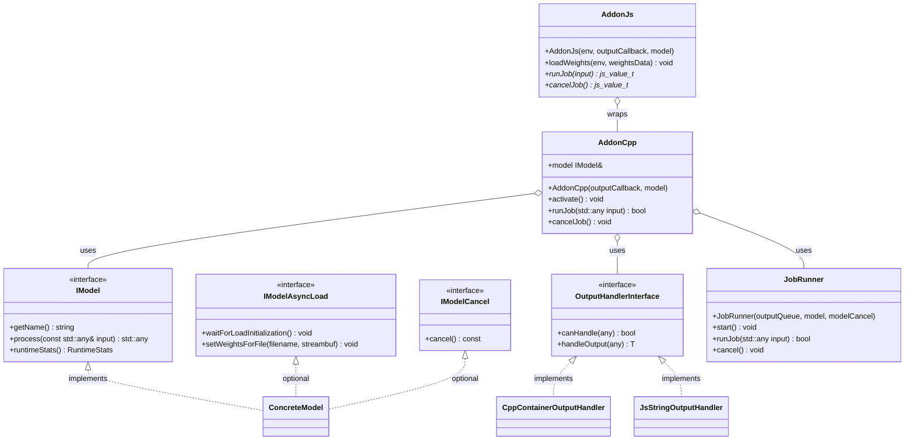
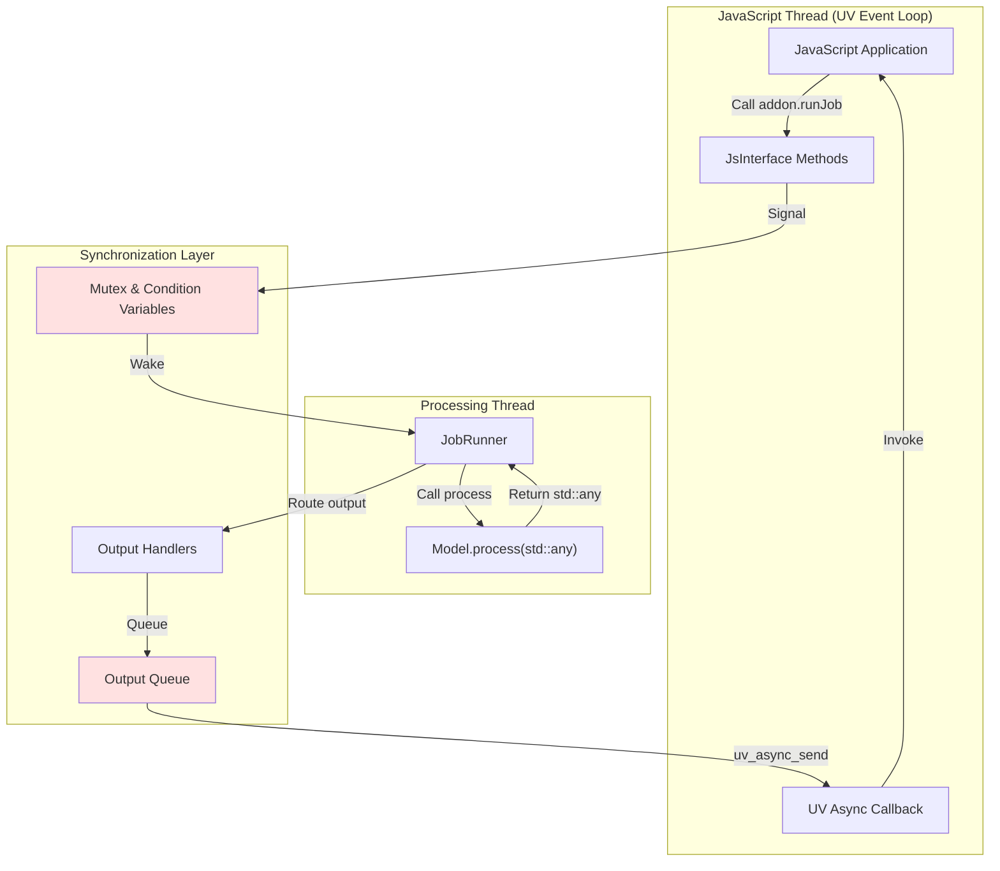

# inference-addon-cpp Architecture Documentation

**Version:** 1.1.7
**Technology Stack:** C++20, CMake, vcpkg, Bare Runtime  
**Package Type:** Header-only C++ library

---

## Table of Contents

- [1. Overview](#1-overview)
  - [Purpose](#purpose)
  - [Key Features](#key-features)
  - [Target Platforms](#target-platforms)
  - [Key Dependencies](#key-dependencies)
  - [Ecosystem Position](#ecosystem-position)
  - [Known Consumers](#known-consumers)
- [2. Core Architecture](#2-core-architecture)
  - [Public API](#public-api)
  - [Internal Architecture](#internal-architecture)
  - [Core Components](#core-components)
  - [Bare Runtime Integration](#bare-runtime-integration)
- [3. Architecture Decisions](#3-architecture-decisions)
  - [Decision 1: Type Erasure via std::any](#decision-1-type-erasure-via-stdany)
  - [Decision 2: Dedicated Processing Thread](#decision-2-dedicated-processing-thread)
  - [Decision 3: Streaming Weight Loading](#decision-3-streaming-weight-loading)
  - [Decision 4: Why Bare Runtime](#decision-4-why-bare-runtime)
  - [Decision 5: Single Job Runner](#decision-5-single-job-runner)
  - [Decision 6: Output Events via Callbacks](#decision-6-output-events-via-callbacks)
  - [Decision 7: Multiple Optional Interfaces](#decision-7-multiple-optional-interfaces)
  - [Decision 8: Output Handlers Pattern](#decision-8-output-handlers-pattern)
- [4. Technical Debt](#4-technical-debt)

---

## 1. Overview

`inference-addon-cpp` is a header-only C++ library that provides common abstractions and infrastructure for building high-performance inference addons on the Bare runtime. This library serves as the foundational framework for QVAC inference addons, handling the complexity of JavaScript-C++ bridging, asynchronous job processing, model lifecycle management, and streaming model weight loading.

### Purpose

This library enables developers to build native inference addons by implementing the `model::IModel` interface with a `process(const std::any& input)` method and registering output handlers. The framework transparently manages: job execution, JavaScript callbacks, event loop integration, multi-threading, and memory management. Jobs are submitted from JavaScript without blocking the calling thread; output is always delivered asynchronously via callback.

### Key Features

- **Simple addon framework** with `process(std::any)` interface for model implementations
- **Single job runner** with cancellation support on a dedicated thread
- **Streaming weight loader** for efficient loading of large model files (including sharded GGUF models)
- **JavaScript-C++ bridge** with comprehensive type marshalling and error handling
- **Output handlers** for flexible output type conversion
- **Thread-safe logging** infrastructure with optional JavaScript callback integration

### Target Platforms

This library targets the same platforms as Bare runtime:

| Platform | Architectures | Status |
|----------|---------------|--------|
| macOS | arm64, x64 | ✅ Supported |
| Linux | arm64, x64 | ✅ Supported |
| Windows | arm64, x64 | ✅ Supported |
| iOS | arm64 | ✅ Supported |
| Android | arm, arm64, ia32, x64 | ✅ Supported |

Platform-specific details are handled by Bare runtime and libuv.

### Key Dependencies

**Build-time:**
- C++20 compiler (GCC 11+, Clang 14+, MSVC 2022+)
- CMake 3.25+
- vcpkg package manager
- qvac-lint-cpp 1.4.4+ (code quality)

**Runtime:**
- Bare runtime (any version with native addon API support)
- Platform-specific: pthread, libuv (provided by Bare)

**Test-time:**
- Google Test (gtest) - optional, only when building tests

### Ecosystem Position

This library sits between the Bare runtime and specific inference addons. Communication between JavaScript and native code is mediated by Bare runtime's native addon API.

```mermaid
graph TB
    subgraph "JavaScript Runtime Environment"
        APP[JavaScript Application]
        BARE[Bare Runtime]
        LIBUV[libuv Event Loop]
        JSENGINE[JavaScript Engine]
        
        APP <--> BARE
        BARE --> LIBUV
        BARE --> JSENGINE
    end
    
    subgraph "Bridging Layer"
        ADDON_CPP[inference-addon-cpp]
    end
    
    subgraph "Inference Addons"
        LLAMA[@qvac/llm-llamacpp]
        WHISPER[@qvac/transcription-whispercpp]
        NMT[@qvac/translation-nmtcpp]
        TTS[@qvac/tts-onnx]
        EMBED[@qvac/embed-llamacpp]
        OCR["@qvac/ocr-onnx"]
    end
    
    subgraph "Native Compute"
        CPU_GPU[CPU/GPU Inference Backends]
    end
    
    BARE <--> ADDON_CPP
    
    ADDON_CPP --> LLAMA
    ADDON_CPP --> WHISPER
    ADDON_CPP --> NMT
    ADDON_CPP --> TTS
    ADDON_CPP --> EMBED
    ADDON_CPP --> OCR
    
    LLAMA --> CPU_GPU
    WHISPER --> CPU_GPU
    NMT --> CPU_GPU
    TTS --> CPU_GPU
    EMBED --> CPU_GPU
    OCR --> CPU_GPU
    
    style ADDON_CPP fill:#e1f5ff
    style BARE fill:#ffe1e1
    style CPU_GPU fill:#ffe1cc
```

<details>
<summary>📊 LLM-Friendly: Ecosystem Diagram as Table</summary>

| Layer | Component | Role |
|-------|-----------|------|
| Application | JavaScript Application | User code consuming inference |
| Runtime | Bare Runtime | JavaScript engine + native addon host |
| Runtime | libuv Event Loop | Async I/O and threading |
| Runtime | JavaScript Engine | JavaScript execution |
| Bridging | inference-addon-cpp | JavaScript bridging and addon orchestration framework (this library) |
| Addons | @qvac/llm-llamacpp | LLM inference using llama.cpp |
| Addons | @qvac/transcription-whispercpp | Speech-to-text using Whisper |
| Addons | @qvac/translation-nmtcpp | Neural machine translation |
| Addons | @qvac/tts-onnx | Text-to-speech using ONNX |
| Addons | @qvac/embed-llamacpp | Text embeddings using llama.cpp |
| Addons | @qvac/ocr-onnx | OCR using ONNX |
| Backend | CPU/GPU Inference Backends | Native ML computation |

**Data Flow:** Application → Bare → addon-cpp → Specific Addon → CPU/GPU Backend

</details>

### Known Consumers

Production addons built on this library:
- **@qvac/llm-llamacpp** - LLM inference using llama.cpp
- **@qvac/transcription-whispercpp** - Speech-to-text using Whisper
- **@qvac/translation-nmtcpp** - Neural machine translation
- **@qvac/tts-onnx** - Text-to-speech using ONNX
- **@qvac/embed-llamacpp** - Text embeddings using llama.cpp
- **@qvac/ocr-onnx** - OCR using ONNX and OpenCV

---

## 2. Core Architecture

### Public API

The library exposes the following main entry points for addon developers:

#### Core Components

1. **`AddonCpp` Class** - The main C++ framework class
2. **`AddonJs` Class** - JavaScript-aware wrapper around AddonCpp
3. **`model::IModel` Interface** - Virtual interface that models must implement with `process(const std::any& input)`
4. **Optional Model Interfaces:**
   - `IModelAsyncLoad` - Asynchronous weight loading
   - `IModelCancel` - Job cancellation support
5. **`OutputHandlerInterface<T>`** - Virtual interface for handling different output types

#### API Structure



<details>
<summary>📊 LLM-Friendly: API Class Relationships</summary>

**Component Hierarchy:**

1. **model::IModel** (Virtual Interface - Base Contract)
   - Required methods:
     - `getName() → string`
     - `process(const std::any& input) → std::any` - Main processing entry point
     - `runtimeStats() → RuntimeStats`
   - Optional interfaces (mixins):
     - `IModelAsyncLoad` - Asynchronous weight loading
     - `IModelCancel` - Job cancellation support

2. **OutputHandlerInterface<T>** (Virtual Interface - Output Type Handling)
   - Handles type erasure via `std::any`
   - Methods: `canHandle(any)`, `handleOutput(any) → T`
   - Concrete implementations: `CppContainerOutputHandler<T>`, `JsStringOutputHandler`, etc.

3. **AddonCpp** (Non-Template Class - Framework Core)
   - Constructor: Takes output callback and model
   - Job execution: `runJob(std::any input)` - runs single job
   - Cancellation: `cancelJob()` - cancels current job
   - Lifecycle: `activate()` - Start processing

4. **AddonJs** (Non-Template Class - JavaScript Wrapper)
   - Wraps AddonCpp with JavaScript integration
   - Methods: `loadWeights()`, `activate()`, `runJob()`, `cancelJob()`

5. **JobRunner** (Internal Class - Job Execution)
   - Manages single job execution on dedicated thread
   - Supports cancellation via `IModelCancel` interface
   - One job at a time (not a queue)

**Usage Pattern:**

```cpp
// C++ addon
auto handler = std::make_shared<
    out_handl::CppContainerOutputHandler<std::set<std::string>>>();

out_handl::OutputHandlers<out_handl::OutputHandlerInterface<void>> outputHandlers;
outputHandlers.add(handler);

auto outputCallback = std::make_unique<OutputCallBackCpp>(std::move(outputHandlers));
auto addon = std::make_unique<AddonCpp>(
    std::move(outputCallback),
    std::make_unique<MyModel>()
);

addon->activate();
addon->runJob(std::any(std::string("Hello")));
```

</details>

### Internal Architecture

#### Architectural Pattern

The library follows a **single-job processing model** with a **dedicated processing thread** for addons that use `AddonCpp`/`JobRunner`. Some consumers, such as synchronous `AddonJs` integrations, may intentionally run model work on the caller thread.

- **Type erasure via `std::any`** - Model receives and returns `std::any` for flexible input/output types
- **Single job runner** - Processes one job at a time with cancellation support
- **Dedicated processing thread** - Isolates heavy inference work from JavaScript event loop for `AddonCpp` users
- **Mutex-protected synchronization** - Thread-safe job execution and cancellation
- **RAII** throughout for automatic resource management



<details>
<summary>📊 LLM-Friendly: Threading Architecture</summary>

**Thread Model:**

The system uses **two threads** with **shared memory** synchronized via **mutex and condition variables**:

**Thread 1: JavaScript Thread (UV Event Loop)**
- Runs user JavaScript code
- Handles all JavaScript API calls (runJob, cancel, etc.)
- Receives async callbacks with model outputs

**Thread 2: Processing Thread (Dedicated C++ Thread)**
- Runs inference workloads via `JobRunner`
- Calls `model->process(const std::any&)`
- Blocks for seconds/minutes on model processing
- Isolated from JavaScript event loop

**Synchronization Layer (Shared Between Threads)**
- `MUTEX` - std::timed_mutex protecting shared state
- `OUTPUT_QUEUE` - std::vector of outputs waiting for JS delivery
- Condition variables for thread wake-up

**Data Flow Steps:**

1. **JS → C++ (Job Submission)**
   - JS calls `addon.runJob(input)` → JsInterface method
   - Lock mutex → Pass job to JobRunner → Signal condition variable
   - Return immediately (non-blocking)

2. **C++ Processing**
   - JobRunner wakes from wait
   - Copies job input, releases lock
   - Calls `model->process(input)` **while mutex unlocked**
   - Output handlers convert result

3. **C++ → JS (Output Delivery)**
   - Lock mutex → Add output to OUTPUT_QUEUE → Unlock
   - Call `uv_async_send()` to wake JavaScript thread

4. **JS Callback Invocation**
   - UV event loop invokes async callback
   - Invoke user's outputCb(event, data) for each output

</details>

### Core Components

#### C++ Components

**AddonCpp.hpp - Main Framework Class**

**Responsibility:** Orchestrates addon lifecycle, manages job execution, coordinates with output handlers

**Key Internals:**
- **Model:** `std::unique_ptr<model::IModel>` - Virtual interface to model implementation
- **JobRunner:** Manages single job execution on dedicated thread
- **Output Queue:** `OutputQueue` - Thread-safe output queue
- **Output Callback:** `OutputCallBackInterface` - Handles output delivery

**JobRunner.hpp - Single Job Execution**

**Responsibility:** Executes a single job at a time on a dedicated thread with cancellation support

**Key Features:**
- Single job execution (not a queue)
- Cancellation via `IModelCancel` interface
- Lock released during `model->process()` to allow cancellation
- Thread-safe job submission

**Output Handlers - Output Type Routing**

**Responsibility:** Convert model output (`std::any`) to appropriate format for C++ or JavaScript

**Key Implementations:**
- **C++ Handlers:**
  - `CppContainerOutputHandler<ContainerT>` - Stores results in thread-safe container
  - `CppQueuedOutputHandler<T>` - Stores results in thread-safe queue
  - `CppLogMsgOutputHandler` - Logs messages via QLOG
  - `CppErrorOutputHandler` - Logs errors via QLOG
- **JavaScript Handlers:**
  - `JsStringOutputHandler` - Converts strings to JavaScript strings
  - `JsTypedArrayOutputHandler<T>` - Converts vectors to JavaScript typed arrays

**BlobsStream.hpp & JsBlobsStream.hpp - Streaming Weight Loader**

**Responsibility:** Provides `std::streambuf` interface over JavaScript-owned memory blobs

**Key Design:**
- `BlobsStream<T>` implements standard `std::basic_streambuf<T>` interface
- Zero-copy access to JavaScript ArrayBuffers
- Supports sharded models (GGUF multi-file)

**JsInterface.hpp - Binding Surface**

**Responsibility:** Shared helper surface used by package `binding.cpp` files for `createInstance`, `loadWeights`, `activate`, `runJob`, `cancel`, `destroyInstance`, and `setLogger` style entry points.

**Key Design:**
- Keeps addon bindings consistent across packages while leaving model-specific parsing in each addon
- Centralizes handle safety and lifecycle conventions around `AddonJs`

### Bare Runtime Integration

#### Key Bare APIs Used

1. **Native Addon System:**
   - `BARE_MODULE(name, init)` macro for addon registration
   - `js_define_methods()` for function exports

2. **Event Loop Integration:**
   - `js_get_env_loop()` to access UV loop
   - `uv_async_t` for cross-thread callbacks
   - `uv_async_send()` to wake JavaScript thread

3. **Value Management:**
   - `js_create_reference()` / `js_delete_reference()` for GC control
   - `js_handle_scope_t` for temporary value lifetime

---

## 3. Architecture Decisions

### Decision 1: Type Erasure via std::any

<details>
<summary>⚡ TL;DR</summary>

**Chose:** `std::any` for input/output type erasure in `IModel::process()`  
**Why:** JavaScript types are dynamic; std::any aligns with this. Simpler API without complex templates.  
**Cost:** Runtime type checking, some overhead

</details>

**Context**

Need a flexible interface supporting diverse model backends with different input/output types.

**Decision**

Use `std::any` in the model interface: `process(const std::any& input) → std::any`

**Rationale**
- JavaScript types are inherently dynamic
- Simpler API than complex template machinery
- Models handle their own type casting internally
- Output handlers convert `std::any` to specific types

### Decision 2: Dedicated Processing Thread

<details>
<summary>⚡ TL;DR</summary>

**Chose:** Dedicated std::thread via JobRunner  
**Why:** Need cancellation support, persistent model state  
**Cost:** One thread per addon instance

</details>

**Context**

Inference is CPU-intensive and blocking (seconds to minutes per job), must integrate with JavaScript event loop.

**Decision**

Spawn dedicated `std::thread` for processing via `JobRunner`.

**Rationale**
- **Cancellation:** Can interrupt long-running jobs via `IModelCancel`
- **State:** Model state persists across jobs
- **Isolation:** Processing doesn't compete with UV event loop

### Decision 3: Streaming Weight Loading

<details>
<summary>⚡ TL;DR</summary>

**Chose:** Streaming via custom std::streambuf over JS ArrayBuffers  
**Why:** Zero-copy, responsive UI, supports sharded models

</details>

**Decision**

Implement custom `std::streambuf` over JavaScript-owned ArrayBuffers with chunked streaming.

### Decision 4: Why Bare Runtime

<details>
<summary>⚡ TL;DR</summary>

**Chose:** Bare runtime instead of Node.js/Electron  
**Why:** Mobile support (iOS/Android), lightweight, modern addon API

</details>

### Decision 5: Single Job Runner

<details>
<summary>⚡ TL;DR</summary>

**Chose:** Single job runner instead of priority queue  
**Why:** Simpler implementation, sufficient for most use cases  
**Cost:** No priority scheduling, one job at a time

</details>

**Context**

Need to execute inference jobs from JavaScript without blocking.

**Decision**

Implement single job runner that processes one job at a time with cancellation support.

**Rationale**
- **Simplicity:** Easier to reason about than priority queue
- **Cancellation:** Clear cancellation semantics for single active job
- **Sufficient:** Most addons process one request at a time anyway
- **Reliability:** Recent 1.1.x fixes focus on cancellation while active, async cancel behavior, callback lifetime, and integration_js coverage; consult `CHANGELOG.md` when changing these paths.

**Trade-offs**

✅ **Benefits:**
- Simple implementation and mental model
- Clear cancellation semantics
- Lower complexity than priority queue

❌ **Drawbacks:**
- No priority scheduling
- Cannot queue multiple jobs
- Application must manage job ordering if needed

### Decision 6: Output Events via Callbacks

<details>
<summary>⚡ TL;DR</summary>

**Chose:** Event callbacks instead of Promises  
**Why:** Supports streaming (multiple outputs per job), diverse event types

</details>

### Decision 7: Multiple Optional Interfaces

<details>
<summary>⚡ TL;DR</summary>

**Chose:** Separate interfaces (`IModel`, `IModelAsyncLoad`, `IModelCancel`) instead of single monolithic interface  
**Why:** Models implement only what they need; simpler tests; capability detection via null checks. Follows good practices for maintanable code, according to the interface segregation principle of SOLID.

</details>

**Context**

Different inference models have different capabilities:
- Some support cancellation, others don't
- Some load weights asynchronously, others load synchronously at construction
- All models must process input and return output

**Decision**

Split model capabilities into separate interfaces:
- `IModel` - Required base interface (`process()`, `getName()`, `runtimeStats()`)
- `IModelAsyncLoad` - Optional interface for streaming weight loading
- `IModelCancel` - Optional interface for job cancellation

**Rationale**

1. **No Empty Implementations:** Models only implement interfaces they actually support. An OCR model that doesn't support cancellation simply doesn't inherit from `IModelCancel`—no need to implement a `cancel()` method that throws "not supported" or does nothing.

2. **Concise Tests:** Tests for a simple model don't need to mock or stub unused capabilities. Testing a model without async loading doesn't require setting up fake streambufs or weight loading infrastructure.

3. **Capability Detection via Null Checks:** The framework can detect capabilities at runtime with simple null pointer checks:
   ```cpp
   // In AddonCpp constructor
   auto* asyncLoad = dynamic_cast<IModelAsyncLoad*>(model.get());
   if (asyncLoad != nullptr) {
       // Enable weight streaming infrastructure
   }
   
   auto* cancelable = dynamic_cast<IModelCancel*>(model.get());
   // JobRunner can check cancelable != nullptr before calling cancel()
   ```
   This is cleaner than:
   - Throwing exceptions from empty implementations
   - Boolean flags like `supportsCancel()` that can get out of sync
   - Try-catch blocks around every optional operation

4. **Easy Feature Extension:** Adding new optional capabilities (e.g., `IModelBatching`) requires only a new interface—existing models are unaffected.

**Trade-offs**

✅ **Benefits:**
- Clean separation of concerns
- No dead code in model implementations
- Simpler, focused tests
- Runtime capability detection without exceptions
- Easy to extend with new optional interfaces

❌ **Drawbacks:**
- Requires `dynamic_cast` for capability detection (minor runtime cost)
- Multiple inheritance when implementing multiple optional interfaces
- Slightly more complex type hierarchy

### Decision 8: Output Handlers Pattern

<details>
<summary>⚡ TL;DR</summary>

**Chose:** Pluggable output handlers with `OutputHandlerInterface<T>` instead of hardcoded output conversion  
**Why:** Uniform pattern for all output types (data, errors, logs); extensible without modifying base classes; follows the Open-Closed Principle

</details>

**Context**

Models produce various output types that need conversion:
- Inference results (strings, vectors, typed arrays)
- Errors that need to reach JavaScript
- Log messages for debugging
- Runtime statistics

Different environments need different conversions:
- C++ tests need outputs stored in thread-safe containers
- JavaScript needs outputs converted to JS values (`js_value_t*`)

**Decision**

Implement a pluggable output handler system:
- `OutputHandlerInterface<T>` - Base interface with `canHandle()` and `handleOutput()`
- `BaseOutputHandler<HandledT, OutT>` - Template base with type-checked conversion
- `OutputHandlers<T>` - Container that routes outputs to matching handlers

**Rationale**

1. **Uniform Pattern for All Output Types:** Errors, logs, and inference outputs all use the same handler pattern:
   ```cpp
   // C++ handlers
   struct CppErrorOutputHandler : BaseOutputHandler<void, Output::Error> { ... };
   struct CppLogMsgOutputHandler : BaseOutputHandler<void, Output::LogMsg> { ... };
   struct CppContainerOutputHandler<T> : BaseOutputHandler<void, T> { ... };
   
   // JavaScript handlers  
   struct JsErrorOutputHandler : JsBaseOutputHandler<Output::Error> { ... };
   struct JsLogMsgOutputHandler : JsBaseOutputHandler<Output::LogMsg> { ... };
   struct JsStringOutputHandler : JsBaseOutputHandler<std::string> { ... };
   ```
   This consistency simplifies understanding and maintenance.

2. **Extensibility Without Modifying Base Classes:** Adding support for a new output type requires only creating a new handler class—no changes to `AddonCpp`, `JobRunner`, or other framework code:
   ```cpp
   // Add support for a new custom output type
   struct JsCustomTypeOutputHandler : JsBaseOutputHandler<MyCustomType> {
       JsCustomTypeOutputHandler()
           : JsBaseOutputHandler<MyCustomType>(
               [this](const MyCustomType& data) -> js_value_t* {
                   return convertToJs(this->env_, data);
               }) {}
   };
   
   // Register it
   outputHandlers.add(std::make_shared<JsCustomTypeOutputHandler>());
   ```
   This follows the **Open-Closed Principle**: open for extension, closed for modification.

3. **Environment-Specific Implementations:** Same model code works in both C++ tests and JavaScript runtime by swapping handler sets:
   - **C++ tests:** Use `CppContainerOutputHandler` to collect results in a `std::set` or `std::vector`
   - **JavaScript runtime:** Use `JsStringOutputHandler`, `JsTypedArrayOutputHandler`, etc.

4. **Type-Safe Routing:** The `canHandle()` method enables runtime type dispatch from `std::any` while maintaining type safety within each handler.

**Trade-offs**

✅ **Benefits:**
- Consistent pattern for all output types (data, errors, logs, stats)
- Add new output conversions without touching framework code
- Same model works in C++ tests and JavaScript runtime
- Clear separation between output production and consumption

❌ **Drawbacks:**
- Indirection through handler lookup (minor runtime cost)
- Requires registering handlers upfront
- Handler order matters if types overlap (first match wins)

---

## 4. Technical Debt

### Implementation Issues

#### 1. Insufficient Error Messages

**Status:** Many errors report generic "InternalError" without context.

**Plan:** Add structured error data with context.

#### 2. No Metrics/Observability

**Status:** No built-in instrumentation hooks for monitoring.

**Plan:** Add optional metrics callback.

### Design Limitations

#### 4. Header-Only Design

**Status:** All code in headers due to template implementations.

**Impact:** Increases compilation time for addons.

---

**Last Updated:** 2026-05-07
**Maintainer:** QVAC Team
