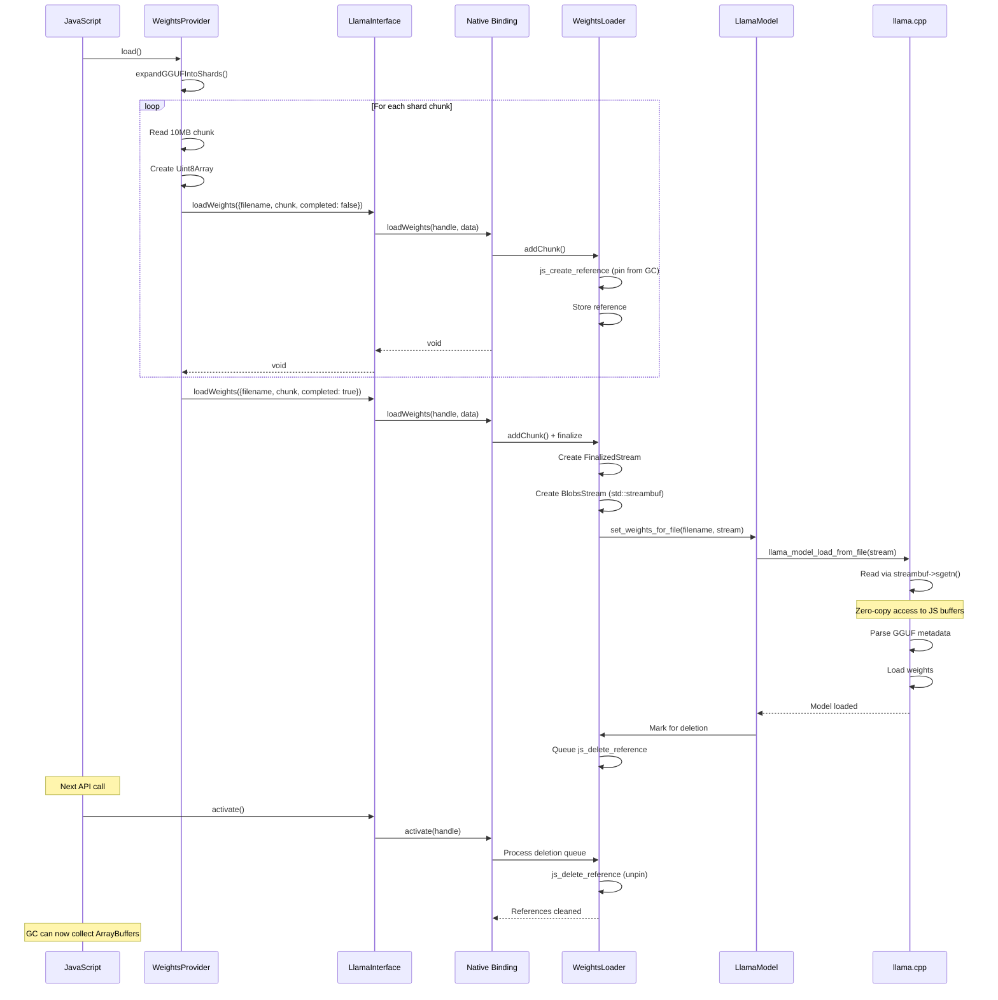
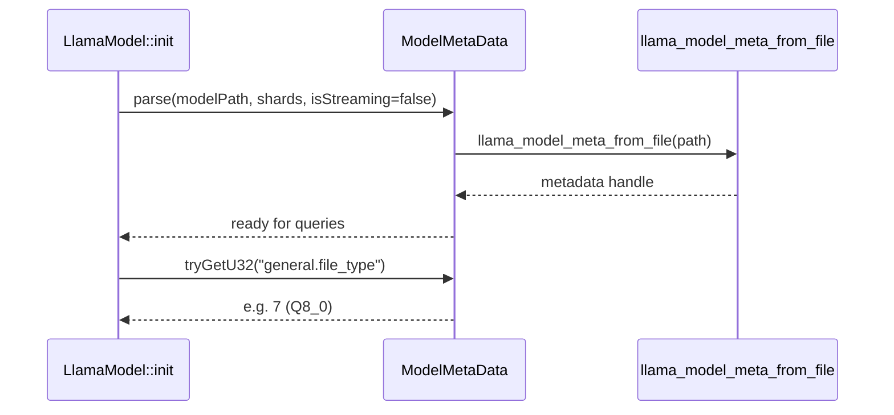
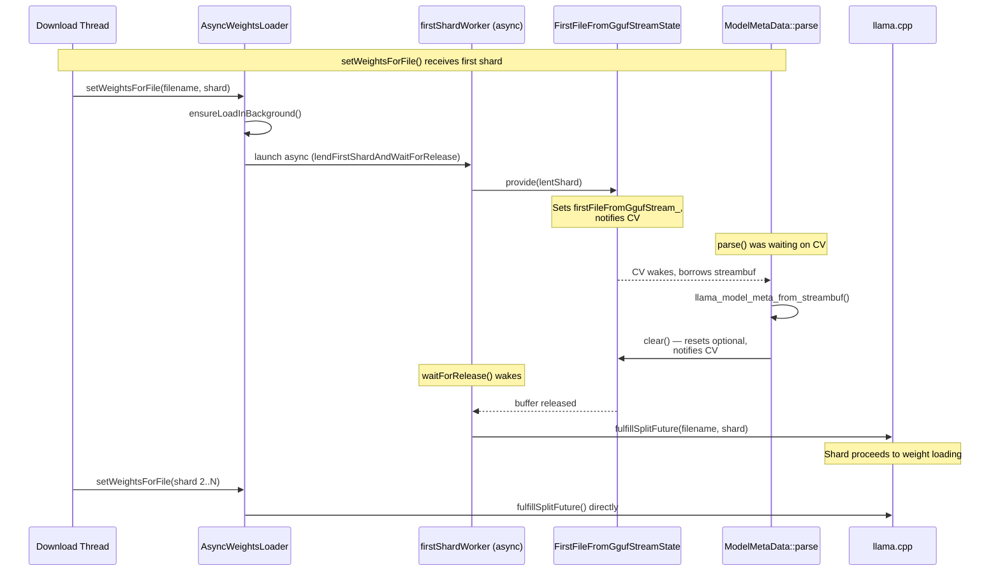
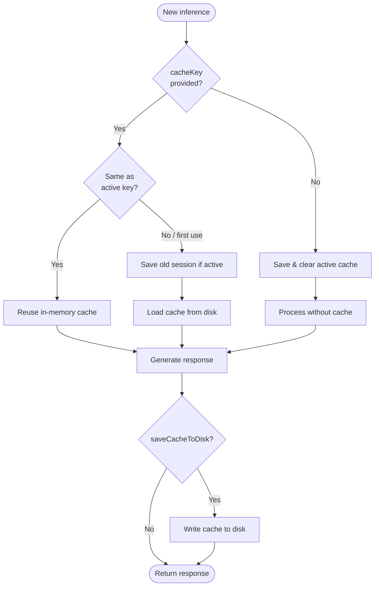

# Detailed Data Flows

This document contains detailed diagrams showing how data moves through the `@qvac/llm-llamacpp` system.

**Audience:** Developers debugging complex behavior, contributors understanding system interactions.

> **⚠️ Note:** These detailed diagrams are intended for initial reference and can quickly become outdated as the codebase evolves. For exact debugging and deep understanding, regenerate diagrams from the actual code or trace through the implementation directly.

⚡ TL;DR: Data Flow Overview

**Communication Pattern:**
- Two-thread architecture: JavaScript thread + dedicated C++ processing thread
- Synchronization via mutex and condition variables
- Cross-thread flow: JS → submit job via `runJob(inputs)` → wake C++ → process single job → output → uv_async_send → JS callback

**Inference Path:**
- JS calls `run(messages)` → returns QvacResponse immediately (non-blocking)
- JS builds inputs array (media items + text), calls `addon.runJob(inputs)` once; returns boolean (accepted or job already active)
- C++ single-job runner takes the job, calls `model.process(std::any)` → generates tokens
- Queues output events → triggers JS callback asynchronously
- Emits: Output (streaming), JobStarted, JobEnded, Error

**Weight Loading:**
- JavaScript sends model weights in chunks (streaming, zero-copy)
- C++ creates std::streambuf over JS ArrayBuffers
- For streamed models, the first shard is lent to `ModelMetaData` for GGUF metadata extraction before proceeding to weight loading
- llama.cpp reads weights via stream interface
- Supports sharded models (GGUF multi-file)
- JS references kept alive during load, cleaned up after

**Session Cache:**
- Optional KV cache persistence to disk via `CacheManager`
- Controlled via `runOptions` fields (`cacheKey`, `saveCacheToDisk`)
- Context overflow only affects RAM; disk cache preserved until explicit save

## Table of Contents

- [Primary Inference Flow](#primary-inference-flow)
- [Weight Loading Flow](#weight-loading-flow)
- [Metadata Extraction Flow](#metadata-extraction-flow)
- [Multimodal Inference Flow](#multimodal-inference-flow)
- [Session Cache Flow](#session-cache-flow)

---

## Primary Inference Flow

### High-Level Flow

```mermaid
flowchart TD
    Start([JS: model.run]) --> ParseMsg[Parse messages array]
    ParseMsg --> CheckMedia{Has media?}
    
    CheckMedia -->|Yes| BuildMedia[Build media items<br/>type: 'media', content]
    CheckMedia -->|No| SerializeJSON[Serialize to JSON]
    BuildMedia --> SerializeJSON
    
    SerializeJSON --> BuildInputs[Build inputs array:<br/>media items + text]
    BuildInputs --> RunJob[addon.runJob&#40;inputs&#41;]
    RunJob --> CreateResp[Create QvacResponse]
    CreateResp --> ReturnJS([Return to JavaScript])
    
    RunJob -.->|Enters C++| LockMutex[Lock mutex]
    LockMutex --> SetJob[Set single job input]
    SetJob --> NotifyCV[Notify condition variable]
    NotifyCV --> UnlockMutex[Unlock mutex]
    
    NotifyCV -.->|Wakes| ProcThread[Processing Thread]
    
    ProcThread --> WaitWork{Has work?}
    WaitWork -->|No| SleepCV[cv.wait]
    SleepCV --> WaitWork
    
    WaitWork -->|Yes| LockProc[Lock mutex]
    LockProc --> TakeJob[Take job input]
    TakeJob --> UnlockProc[Unlock mutex]
    UnlockProc --> EmitStart[Queue JobStarted event]
    EmitStart --> SendAsync1[uv_async_send]
    
    SendAsync1 --> GetInput[Get next input piece]
    GetInput --> CheckType{Input type?}
    
    CheckType -->|Text| ParseChat[Parse JSON to chat_msg]
    CheckType -->|Media| LoadImage[Load image data]
    
    ParseChat --> FormatPrompt[Format with chat template]
    LoadImage --> FormatPrompt
    
    FormatPrompt --> Tokenize[Tokenize prompt]
    Tokenize --> LlamaDecode[llama_decode<br/>Process prompt]
    
    LlamaDecode --> GenLoop{Generate tokens}
    GenLoop -->|Continue| Sample[llama_sampler_sample]
    Sample --> CheckEOS{EOS token?}
    CheckEOS -->|No| DecodeToken[Decode token to UTF-8]
    DecodeToken --> LockOut[Lock output mutex]
    LockOut --> QueueOutput[Queue Output event]
    QueueOutput --> UnlockOut[Unlock mutex]
    UnlockOut --> SendAsync2[uv_async_send]
    SendAsync2 --> GenLoop
    
    CheckEOS -->|Yes| GetStats[Collect runtime stats]
    GetStats --> QueueJobEnd[Queue JobEnded event]
    QueueJobEnd --> SendAsync3[uv_async_send]
    SendAsync3 --> ProcThread
    
    GenLoop -->|Error| QueueError[Queue Error event]
    QueueError --> ResetModel[model.reset]
    ResetModel --> SendAsync3
    
    SendAsync2 -.->|Triggers| UVCallback[UV async callback]
    UVCallback --> LockCB[Lock output mutex]
    LockCB --> DequeueOutputs[Dequeue all outputs]
    DequeueOutputs --> UnlockCB[Unlock mutex]
    UnlockCB --> ForEach[For each output event]
    
    ForEach --> InvokeJS[Call JavaScript outputCb]
    InvokeJS --> UpdateResponse[QvacResponse emits]
    UpdateResponse --> IterYield([Async iterator yields token])
```

📊 LLM-Friendly: Inference Flow Breakdown

**Phase 1: Job Submission (JavaScript → C++)**

| Step | Thread | Duration | Operation | Blocking? |
|------|--------|----------|-----------|-----------|
| 1 | JS | <0.1ms | Parse messages | No |
| 2 | JS | <0.1ms | Serialize to JSON | No |
| 3 | JS | <1ms | Call addon.runJob(inputs) | No |
| 4 | JS | <0.1ms | Lock mutex | No |
| 5 | JS | <0.1ms | Set job input | No |
| 6 | JS | <0.1ms | Signal CV | No |
| 7 | JS | <0.1ms | Unlock mutex | No |
| 8 | JS | <0.1ms | Return accepted (boolean) | No |
| 9 | C++ | - | Wake from cv.wait() | - |

**Phase 2: Processing (C++ Background Thread)**

| Step | Thread | Duration | Operation | Blocks JS? |
|------|--------|----------|-----------|------------|
| 10 | C++ | <0.1ms | Lock mutex | No |
| 11 | C++ | <0.1ms | Take job input | No |
| 12 | C++ | <0.1ms | Unlock mutex | No |
| 13 | C++ | <1ms | Parse JSON | No |
| 14 | C++ | 1-10ms | Format chat template | No |
| 15 | C++ | 10-100ms | Tokenize | No |
| 16 | C++ | 100ms-10s | llama_decode (prompt) | No |
| 17 | C++ | 10-100ms per token | Sample & decode token | No |

**Phase 3: Output Delivery (C++ → JavaScript)**

| Step | Thread | Duration | Operation | Details |
|------|--------|----------|-----------|---------|
| 18 | C++ | <0.1ms | Lock output mutex | Per token |
| 19 | C++ | <0.1ms | Queue output | Per token |
| 20 | C++ | <0.1ms | Unlock mutex | Per token |
| 21 | C++ | <0.1ms | uv_async_send() | May coalesce |
| 22 | JS | - | UV schedules callback | Next tick |
| 23 | JS | <0.1ms | Lock mutex | Batch |
| 24 | JS | <0.1ms | Drain outputs | Batch |
| 25 | JS | <0.1ms | Unlock mutex | Batch |
| 26 | JS | Varies | Invoke outputCb | User code |

**Event Types:**

| Event | When | Data | Purpose |
|-------|------|------|---------|
| JobStarted | First input processed | {jobId, timestamp} | Track start |
| Output | Each token generated | {jobId, output: string, isPartial: true} | Stream text |
| JobEnded | All input processed | {jobId, stats: RuntimeStats} | Track completion |
| Error | Processing fails | {jobId, error: string} | Error handling |

**Performance Characteristics:**

- Job queueing: <1ms total
- Prompt processing: 100ms-10s (prompt length dependent)
- Token generation: 10-100ms per token (model dependent)
- Output callback: <1ms overhead + user callback time
- Coalescing: Multiple tokens may arrive in single callback

---

## Weight Loading Flow

### Streaming Weight Loading

📊 LLM-Friendly: Weight Loading Steps

**Memory Lifecycle:**

| Stage | JS Buffer State | C++ Reference State | Memory Location | Notes |
|-------|-----------------|---------------------|-----------------|-------|
| 1. Create | Allocated by JS | None | JS heap | Uint8Array created |
| 2. loadWeights() | Passed to C++ | js_create_reference() | JS heap | Pinned from GC |
| 3. Accumulation | Still in JS | Stored in vector | JS heap | Multiple refs held |
| 4. Finalize | Still in JS | Owned by FinalizedStream | JS heap | RAII wrapper |
| 5. Loading | Still in JS | Active | JS heap | Zero-copy access |
| 6. Load complete | Still in JS | Marked for deletion | JS heap | Queued cleanup |
| 7. Next API call | Still in JS | js_delete_reference() | JS heap | Unpinned |
| 8. After return | May be GC'd | None | Freed | Memory reclaimed |

**Sharded Model Handling:**

Input: `"model-00001-of-00004.gguf"`

Expanded to:
1. `model-00001-of-00004.gguf`
2. `model-00002-of-00004.gguf`
3. `model-00003-of-00004.gguf`
4. `model-00004-of-00004.gguf`

JavaScript sends each file separately. C++ concatenates into single logical stream.

**Performance:**

| Operation | Duration | Memory Impact | Notes |
|-----------|----------|---------------|-------|
| Create 10MB chunk | ~1ms | +10MB JS heap | Async I/O |
| loadWeights() call | <1ms | +small C++ overhead | Non-blocking |
| FinalizeStream | ~0.1ms | Transfer ownership | Zero-copy |
| llama_model_load() | Seconds | +model size in RAM | Background thread |
| Reference cleanup | <0.1ms | -10MB JS heap per chunk | Deferred to JS thread |

---

## Metadata Extraction Flow

`ModelMetaData` extracts GGUF key-value metadata (e.g., quantization type, architecture) from the model file *before* weights are loaded. This allows early decisions like backend selection and quantization detection without loading gigabytes of tensor data into memory.

### Disk-Based Models

For models loaded from disk, metadata is read directly from the file:

### Streamed Models (Sharded)

For streamed models, the first shard must be shared between metadata parsing and weight loading. `AsyncWeightsLoader` coordinates this handoff:

📊 LLM-Friendly: Metadata Extraction Details

**Thread Coordination:**

| Thread | Role | Blocks On |
|--------|------|-----------|
| Download (JS) | Delivers shards via `setWeightsForFile()` | Nothing (first shard launches async worker) |
| firstShardWorker | Lends first shard to metadata, then forwards to llama.cpp | `waitForRelease()` — metadata consumer releasing the buffer |
| Init (background) | Calls `metadata_.parse()` which waits for streamed buffer | `waitConsumeAndClear()` — provider delivering the buffer |

**Synchronization:**

| Primitive | Purpose | Timeout |
|-----------|---------|---------|
| `condition_variable` + `wait_for` | `waitConsumeAndClear` blocks until `provide()` delivers the buffer | 15s (configurable via template parameter) |
| `condition_variable` + `wait_for` | `waitForRelease` blocks until metadata consumer releases the buffer | 60s (configurable via template parameter) |

**Available Metadata Queries:**

| Method | Returns | Use Case |
|--------|---------|----------|
| `tryGetU32(key)` | `optional<uint32_t>` | Read any GGUF u32 key |
| `isU32OneOf(key, values)` | `bool` | Check if a key matches expected values |
| `hasOneBitQuantization()` | `bool` | Detect TQ1_0/TQ2_0 quantization |

---

## Multimodal Inference Flow

For vision + text models (e.g., LLaVA, Qwen2.5-Omni):

```mermaid
flowchart LR
    Start([JS: run with media]) --> CheckMsg{Message has<br/>type: 'media'?}
    
    CheckMsg -->|Yes| BuildMedia[Build media items<br/>type: 'media', content: Uint8Array]
    CheckMsg -->|No| BuildText
    
    BuildMedia --> ModifyMsg[Modify message<br/>content: empty string]
    ModifyMsg --> BuildText[Build text item<br/>type: 'text', input: JSON]
    
    BuildText --> RunJob[addon.runJob&#40;&#91;media..., text&#93;&#41;]
    RunJob --> ProcessMedia{Has media?}
    ProcessMedia -->|Yes| LoadImage[LlamaModel.LoadMedia<br/>load image via llava]
    ProcessMedia -->|No| SkipMedia
    
    LoadImage --> EmbedImage[Generate image embeddings<br/>via projection model]
    EmbedImage --> SkipMedia[Continue to text]
    
    SkipMedia --> FormatPrompt[Format chat template<br/>with image placeholder]
    FormatPrompt --> Tokenize[Tokenize text]
    Tokenize --> Decode[llama_decode<br/>text + image embeddings]
    Decode --> Generate[Generate tokens]
    Generate --> Output([Stream output])
```

📊 LLM-Friendly: Multimodal Flow

**Message Processing:**

| Message | Role | Type | Content | Processing |
|---------|------|------|---------|-------------|
| 1 | user | media | Uint8Array (image) | Add to inputs array as `{ type: 'media', content }`, clear content in chat |
| 2 | user | text | "What do you see?" | Add to inputs array as `{ type: 'text', input: JSON }` |

**Image Loading Methods:**

Images can be provided in two ways:
1. **As Uint8Array**: Image data loaded into memory in JavaScript and passed as binary buffer
2. **As filesystem path**: String path to image file, loaded directly by C++ layer

**Image Processing:**

| Step | Component | Operation | Output |
|------|-----------|-----------|--------|
| 1 | JavaScript | Read image file or pass path | Uint8Array or string |
| 2 | LlamaModel | Load via llava | Image handle |
| 3 | Projection model | Encode image | Embeddings tensor |
| 4 | LlamaModel | Concatenate with text | Combined input |
| 5 | llama.cpp | Process | Text output |

---

## Session Cache Flow

`CacheManager` persists KV cache state between inference calls for multi-turn conversations. Cache is controlled via `runOptions` fields (`cacheKey`, `saveCacheToDisk`).

**Cache Control:**
- Disk cache only modified on explicit `saveCacheToDisk: true` or session switch
- Context overflow discards tokens from RAM only; disk cache preserves state before overflow
- No automatic cache invalidation in the addon

---

**Related Documents:**
- [architecture.md](architecture.md) - Complete architecture documentation

**Last Updated:** 2026-03-02

