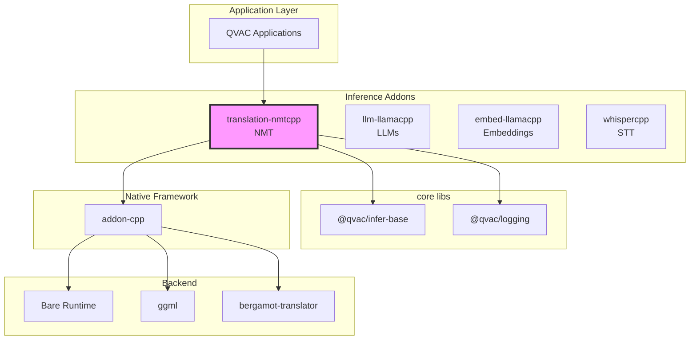
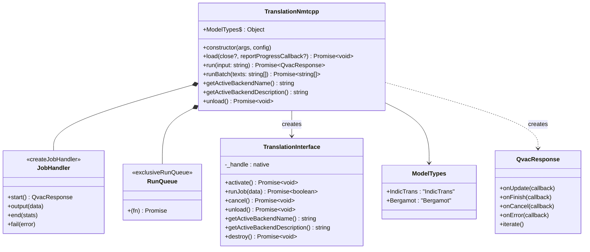
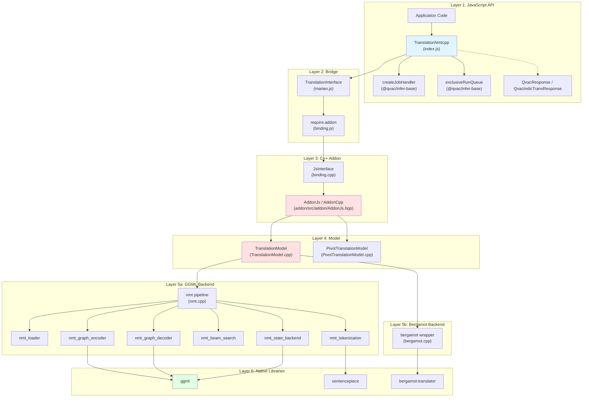
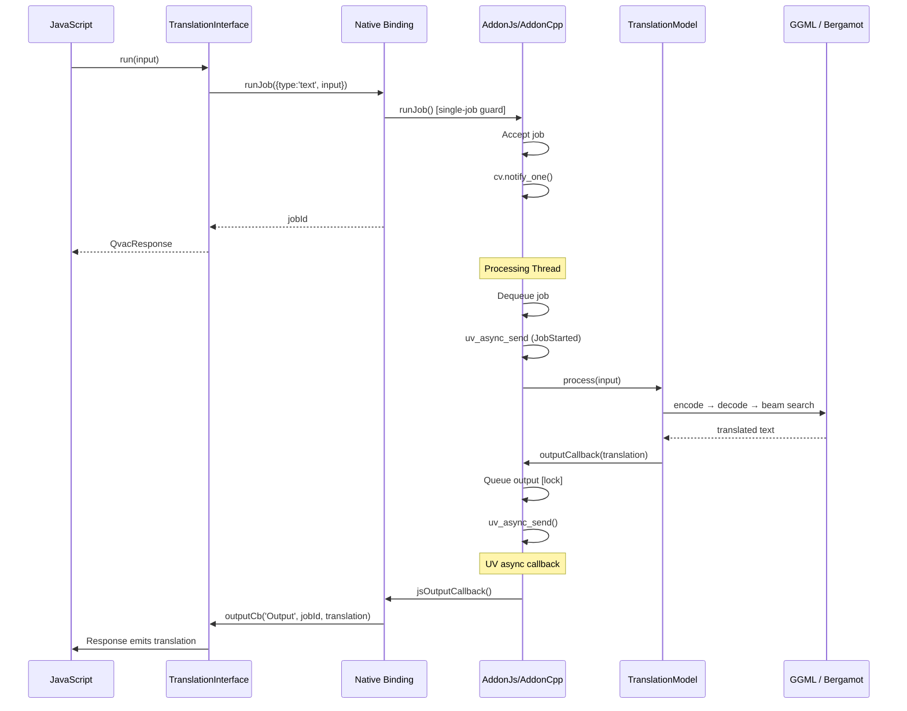

# Architecture Documentation

**Package:** `@qvac/translation-nmtcpp` v2.1.1
**Stack:** JavaScript, C++20, GGML, Bergamot, Bare Runtime, CMake, vcpkg  
**License:** Apache-2.0

---

## Table of Contents

### Overview
- [Purpose](#purpose)
- [Key Features](#key-features)
- [Target Platforms](#target-platforms)

### Core Architecture
- [Package Context](#package-context)
- [Public API](#public-api)
- [Internal Architecture](#internal-architecture)
- [Core Components](#core-components)
- [Bare Runtime Integration](#bare-runtime-integration)

### Architecture Decisions
- [Decision 1: GGML as Inference Backend](#decision-1-ggml-as-inference-backend-for-indictrans2)
- [Decision 2: Bare Runtime over Node.js](#decision-2-bare-runtime-over-nodejs)
- [Decision 3: Multiple NMT Backends](#decision-3-multiple-nmt-backends-ggml--bergamot)
- [Decision 4: SentencePiece Tokenization](#decision-4-sentencepiece-tokenization)
- [Decision 5: Queue-Based Inference via Addon Framework](#decision-5-queue-based-inference-via-addon-framework)

### Technical Debt
- [Legacy "Marian" Naming](#1-legacy-marian-naming)
- [Whisper.cpp as Indirect GGML Provider](#2-whispercpp-as-indirect-ggml-provider)
- [Overlay Ports Instead of Registry](#3-overlay-ports-instead-of-registry)

---

# Overview

## Purpose

Offline neural machine translation for QVAC-powered applications (mobile and desktop). Translates text between language pairs using multiple NMT backends, each optimized for different language families and performance profiles.

**Core value:**
- High-level JavaScript API for NMT inference
- Caller-supplied local model files, with registry/examples outside the runtime path
- Multi-backend architecture (IndicTrans2, Bergamot)
- Batch translation support
- Pivot translation and lazy GGML backend loading

## Key Features

- **Multi-backend architecture:** GGML-based custom NMT (IndicTrans2) and Mozilla Bergamot
- **Cross-platform support:** macOS, iOS, Linux, Android, Windows
- **GPU acceleration:** via GGML backends (Metal on Apple, Vulkan/OpenCL where configured)
- **Beam search decoding** with configurable beam size, length penalty, and repetition control
- **SentencePiece tokenization** for subword segmentation
- **Batch translation** (Bergamot backend) for high-throughput scenarios
- **Local model files** supplied through constructor `files`
- **Single-job inference** with cancel support and JS-level serialization

## Target Platforms

| Platform | Architecture | Min Version | Status | GPU Support |
|----------|-------------|-------------|--------|-------------|
| macOS | arm64, x64 | 14.0+ | ✅ Tier 1 | Metal |
| iOS | arm64 | 17.0+ | ✅ Tier 1 | Metal |
| Linux | arm64, x64 | Ubuntu-22+ | ✅ Tier 1 | Vulkan |
| Android | arm64 | 12+ | ✅ Tier 1 | Vulkan |
| Windows | x64 | 10+ | ✅ Tier 1 | Vulkan |

**Dependencies:**
- inference-addon-cpp (≥1.1.5#1): C++ addon framework
- @qvac/infer-base (^0.4.0): `createJobHandler`, `exclusiveRunQueue`, QvacResponse
- ggml (vcpkg): Tensor computation and GPU backends
- sentencepiece (vcpkg): Subword tokenization
- bergamot-translator (vcpkg, optional): Mozilla Bergamot translation engine
- Bare Runtime (≥1.19.0): JavaScript runtime

---

# Core Architecture

## Package Context

### Ecosystem Position

📊 LLM-Friendly: Package Relationships

**Dependency Table:**

| Package | Type | Version | Purpose |
|---------|------|---------|---------|
| @qvac/infer-base | Framework | ^0.4.0 | `createJobHandler`, `exclusiveRunQueue`, QvacResponse |
| @qvac/logging | Runtime | ^0.1.0 | Logger bridge for JS and native logs |
| @qvac/registry-client | Dev/example | ^0.4.0 | Optional model distribution examples, not runtime loading |
| inference-addon-cpp | Native | ≥1.1.5#1 | C++ addon framework (`AddonJs`/`AddonCpp`, runJob, cancel) |
| ggml | Native | (vcpkg) | Tensor computation and GPU backends |
| sentencepiece | Native | (vcpkg) | Subword tokenization |
| protobuf | Native | (vcpkg) | SentencePiece model serialization |
| bergamot-translator | Native | (vcpkg, optional) | Mozilla Bergamot translation engine |
| Bare Runtime | Runtime | ≥1.19.0 | JavaScript execution |

**Integration Points:**

| From | To | Mechanism | Data Format |
|------|----|-----------|-------------|
| JavaScript | TranslationNmtcpp | Constructor | args, config objects |
| TranslationNmtcpp | createJobHandler / exclusiveRunQueue | Composition | Job lifecycle + single-job serialization |
| TranslationNmtcpp | TranslationInterface | Composition | Method calls |
| TranslationInterface | C++ Addon | require.addon() | Native binding |
| TranslationNmtcpp | files/config | Constructor | Local model/vocab/pivot/backend paths |

---

## Public API

### Main Class: TranslationNmtcpp

📊 LLM-Friendly: Class Responsibilities

**Component Roles:**

| Class | Responsibility | Lifecycle | Dependencies |
|-------|---------------|-----------|--------------|
| TranslationNmtcpp | Orchestrate model lifecycle, local file paths, pivot config, loading/inference | Created by user, persistent | TranslationInterface, createJobHandler, exclusiveRunQueue |
| QvacResponse | Stream inference output | Created per run() call, short-lived | None |
| TranslationInterface | JS wrapper around native `runJob`, cancel, backend introspection, and logging | Created in `_load()` | Native binding |

**Key Relationships:**

| From | To | Type | Purpose |
|------|----|------|---------|
| TranslationNmtcpp | createJobHandler | Composition | Response lifecycle |
| TranslationNmtcpp | exclusiveRunQueue | Composition | Serialize load/run/runBatch/unload |
| TranslationNmtcpp | TranslationInterface | Composition | Native addon operations |
| TranslationNmtcpp | QvacResponse | Creates | Streaming output per inference |

---

## Internal Architecture

### Architectural Pattern

The package follows a **layered architecture** with clear separation of concerns:

📊 LLM-Friendly: Layer Responsibilities

**Layer Breakdown:**

| Layer | Components | Responsibility | Language | Why This Layer |
|-------|-----------|---------------|----------|----------------|
| 1. JavaScript API | TranslationNmtcpp, createJobHandler, exclusiveRunQueue | High-level API, response lifecycle, error handling | JS | Ergonomic API for npm consumers |
| 2. Bridge | TranslationInterface, binding.js | JS↔C++ communication | JS wrapper | Lifecycle management, handle safety |
| 3. C++ Addon | JsInterface, AddonJs/AddonCpp | Single-job runner, threading, callbacks | C++ | Performance, native integration |
| 4. Model | TranslationModel, PivotTranslationModel | Backend detection, pivot routing, dispatch | C++ | Multi-backend routing |
| 5a. GGML Backend | nmt_* modules | Custom encoder-decoder with beam search | C++ | IndicTrans2 inference |
| 5b. Bergamot Backend | bergamot wrapper | Bergamot translator integration | C++ | Batch-optimized translation |
| 6. Native Libraries | ggml, sentencepiece, bergamot | Tensor ops, tokenization, translation | C++ | Optimized inference |

**Data Flow Through Layers:**

| Direction | Path | Data Format | Transform |
|-----------|------|-------------|-----------|
| Input → | JS → Bridge → Addon | string | Pass input text |
| Input → | Addon → Model | std::string | Route to backend |
| Input → | Model → nmt_* | tokens | SentencePiece tokenize |
| Output ← | nmt_* → Model | token IDs | Beam search → detokenize |
| Output ← | Model → Addon | UTF-8 string | Queue output |
| Output ← | Addon → Bridge → JS | string | Emit via callback |

---

## Core Components

### JavaScript Components

#### **TranslationNmtcpp (index.js)**

**Responsibility:** Main API class, orchestrates model lifecycle, validates caller-supplied local file paths, configures optional pivot translation, and routes requests to the native backend.

**Why JavaScript:**
- High-level API ergonomics for npm consumers
- Promise/async-await integration
- IndicTrans pre/post-processing via third-party JS module
- Configuration parsing
- `createJobHandler` and `exclusiveRunQueue` for response lifecycle and one native job at a time

#### **TranslationInterface (marian.js)**

**Responsibility:** JavaScript wrapper around native addon, manages handle lifecycle

**Why JavaScript:**
- Clean JavaScript API over raw C++ bindings
- Native handle lifecycle management
- Logger bridge (C++ → JS)
- Type conversion between JS and native

#### **QvacIndicTransResponse (index.js)**

**Responsibility:** IndicTrans-specific response with pre/post-processing via `IndicProcessor`

**Why JavaScript:**
- Script normalization/denormalization is text processing, not performance-critical
- Leverages existing third-party IndicProcessor JS module

### C++ Components

#### **TranslationModel (model-interface/TranslationModel.cpp)**

**Responsibility:** High-level model: backend detection (GGML vs Bergamot), config management, dispatch

**Why C++:**
- Direct integration with both GGML and Bergamot C/C++ APIs
- Backend auto-detection from model file format
- Unified process() interface over heterogeneous backends

#### **AddonJs / AddonCpp (addon/src/addon/AddonJs.hpp)**

**Responsibility:** Package-specific integration with the addon-cpp 1.x framework.

**Why C++:**
- Provides single-job execution and cancellation
- Dedicated processing thread
- Thread-safe state machine
- Output dispatching via uv_async
- `runJob` accepts single text or `type: 'sequences'` batch payloads

#### **PivotTranslationModel (model-interface/PivotTranslationModel.cpp)**

**Responsibility:** Routes source → pivot → target translation when `config.pivotModel` and the corresponding pivot files/config are supplied.

**Why C++:**
- Keeps multi-step translation close to model dispatch
- Reuses the same native backend abstractions as direct translation

#### **nmt_context / nmt_* (model-interface/nmt*.cpp)**

**Responsibility:** GGML-based NMT: encode, decode, full translation pipeline

**Why C++:**
- Performance-critical inference loop (encoder/decoder graphs)
- Direct GGML tensor operations
- Beam search with KV cache management
- SentencePiece integration for tokenization

**Key structures:** `nmt_context`, `nmt_model`, `nmt_state`, `nmt_vocab`, `nmt_config`, `nmt_kv_cache`

#### **bergamot_context (model-interface/bergamot.cpp)**

**Responsibility:** Bergamot wrapper: init, translate, batch translate, runtime stats

**Why C++:**
- Wraps Mozilla bergamot-translator C++ library
- Exposes single and batch translation
- Manages BlockingService and TranslationModel lifecycle

#### **NmtLazyInitializeBackend (model-interface/NmtLazyInitializeBackend.cpp)**

**Responsibility:** Lazy GGML backend/plugin loading.

**Why C++:**
- Defers backend initialization until model activation
- Supports `backendsDir`, `openclCacheDir`, and optional OpenCL backend configuration

---

## Bare Runtime Integration

### Communication Pattern

📊 LLM-Friendly: Thread Communication

**Thread Responsibilities:**

| Thread | Runs | Blocks On | Can Call |
|--------|------|-----------|---------|
| JavaScript | App code, callbacks | Nothing (event loop) | All JS, addon methods |
| Processing | Inference | model.process() | model.*, uv_async_send() |

**Synchronization Primitives:**

| Primitive | Purpose | Held Duration | Risk |
|-----------|---------|--------------|------|
| std::mutex | Protect job queue | <1ms | Low (brief) |
| std::condition_variable | Wake processing thread | N/A | None |
| uv_async_t | Wake JS thread | N/A | None |

**Thread Safety Rules:**

1. ✅ Call addon methods from any thread
2. ✅ Processing thread calls model methods
3. ❌ Don't call JS functions from C++ thread (use uv_async_send)
4. ❌ Don't call model methods from JS thread

---

# Architecture Decisions

## Decision 1: GGML as Inference Backend for IndicTrans2

⚡ TL;DR

**Chose:** Custom encoder-decoder on GGML for lightweight cross-platform inference  
**Why:** Cross-platform portability, quantization support, no heavy dependencies  
**Cost:** Custom encoder/decoder graphs require maintenance

### Context

Needed to run NMT models on mobile devices (iOS, Android) and desktop without heavy ML framework dependencies.

### Decision

Implemented a custom encoder-decoder inference engine on top of GGML tensors, with hand-built computation graphs for self-attention, cross-attention, FFN, and beam search.

### Rationale

**Portability:**
- GGML provides cross-platform tensor operations with minimal dependencies
- Supports multiple GPU backends (Metal, Vulkan) through a unified API
- No dependency on Python, CUDA, or heavy ML frameworks

**Efficiency:**
- Enables model quantization for reduced memory footprint on mobile
- Single dependency (ggml) for all tensor computation

### Trade-offs
- ✅ Runs on all target platforms including iOS and Android
- ✅ Quantization support reduces model size significantly
- ✅ Single dependency (ggml) for all tensor computation
- ❌ Custom encoder/decoder graphs require maintenance when model architectures evolve
- ❌ Performance tuning must be done manually per-platform

---

## Decision 2: Bare Runtime over Node.js

See [inference-addon-cpp Decision 4: Why Bare Runtime](https://github.com/tetherto/inference-addon-cpp/blob/main/docs/architecture.md#decision-4-why-bare-runtime) for rationale.

**Summary:** Mobile support (iOS/Android), lightweight, modern addon API. Core business logic remains runtime-agnostic.

---

## Decision 3: Multiple NMT Backends (GGML + Bergamot)

⚡ TL;DR

**Chose:** Two backends behind a unified API  
**Why:** Different language families need different model architectures and optimizations  
**Cost:** Two backends to build, test, and maintain

### Context

Different language families require different model architectures. Indic languages are served by IndicTrans2, and some use cases benefit from Mozilla's Bergamot for batch throughput.

### Decision

Support two model types behind a unified `TranslationNmtcpp` API, with backend auto-detection based on model file format.

### Rationale

**Language Coverage:**
- IndicTrans2: purpose-built for Indic languages with specialized pre/post-processing
- Bergamot: mature, production-tested engine with batch translation support

**Unified API:**
- Consumers use the same `load()` / `run()` / `runBatch()` regardless of backend
- Backend selection is transparent via `ModelTypes` enum

### Trade-offs
- ✅ Best-in-class translation for each language family
- ✅ Unified API hides backend complexity from consumers
- ❌ Two backends to build, test, and maintain
- ❌ Different model formats and loading paths increase code complexity

---

## Decision 4: SentencePiece Tokenization

⚡ TL;DR

**Chose:** SentencePiece library for tokenization  
**Why:** Standard tokenizer used by IndicTrans2 model authors  
**Cost:** Additional native dependency (protobuf required)

### Context

NMT models require subword tokenization. IndicTrans2 models ship with SentencePiece vocabulary files.

### Decision

Use the SentencePiece library for tokenization and detokenization, loading vocabulary from model files or separate `.spm` files.

### Rationale

**Compatibility:**
- Standard tokenizer used by IndicTrans2 model authors
- Handles both source and target vocabularies with a unified API
- Integrates cleanly with GGML model loading

### Trade-offs
- ✅ Direct compatibility with upstream model vocabularies
- ✅ Battle-tested library with broad language support
- ❌ Requires protobuf as transitive dependency
- ❌ Bergamot bundles its own SentencePiece, requiring careful linking

---

## Decision 5: Queue-Based Inference via Addon Framework

⚡ TL;DR

**Chose:** `inference-addon-cpp` 1.x `AddonJs` / `AddonCpp` framework
**Why:** Shared single-job runner, cancellation, output events, and JS bridge across QVAC inference addons
**Cost:** One request at a time per native instance

### Context

Translation requests arrive from the JavaScript thread but inference must run on a separate C++ thread to avoid blocking the event loop.

### Decision

Use addon-cpp's `AddonJs` / `AddonCpp` pattern, which provides a single-job runner, worker thread, cancellation, and callback mechanism for communicating results back to JavaScript. JavaScript submits complete requests with `runJob`; batch translation uses `runJob({ type: 'sequences', input })`.

### Rationale

**Proven Pattern:**
- Used by all QVAC inference addons (LLM, embeddings, STT)
- Handles thread synchronization, lifecycle management, and error propagation
- Supports cancel; pause/resume was removed with the 1.x addon framework migration

**Consistency:**
- Same addon patterns across all inference packages
- Shared C++ framework reduces code duplication

### Trade-offs
- ✅ Battle-tested threading and lifecycle management
- ✅ Consistent patterns across QVAC inference addons
- ❌ One request at a time per model instance (exclusive run queue)
- ❌ Template metaprogramming adds build complexity

---

# Technical Debt

### 1. Legacy "Marian" Naming
**Status:** Present throughout codebase  
**Issue:** `marian.js`, `QvacErrorAddonMarian`, namespace `qvac_lib_inference_addon_mlc_marian` predate multi-backend architecture  
**Root Cause:** Renaming requires coordinated changes across JS, C++, and consumer packages  
**Plan:** Rename in a dedicated refactoring PR — `marian.js` → `translationInterface.js`, `QvacErrorAddonMarian` → `QvacErrorTranslation`, namespace → `qvac_lib_infer_nmtcpp`

### 2. Native Backend Supply Chain
**Status:** Current dependency resolution uses `vcpkg-configuration.json` and the shared QVAC registry rather than the older local overlay-port layout.
**Issue:** Contributors still need to understand which GGML, qvac-fabric, Bergamot, and optional OpenCL components are resolved through vcpkg.
**Plan:** Keep `vcpkg.json`, `vcpkg-configuration.json`, and this architecture doc aligned when adding or removing backend plugins.

---

**Related Document:**
- [data-flows-detailed.md](data-flows-detailed.md) - Detailed data flow diagrams and sequences

**Last Updated:** 2026-05-07
