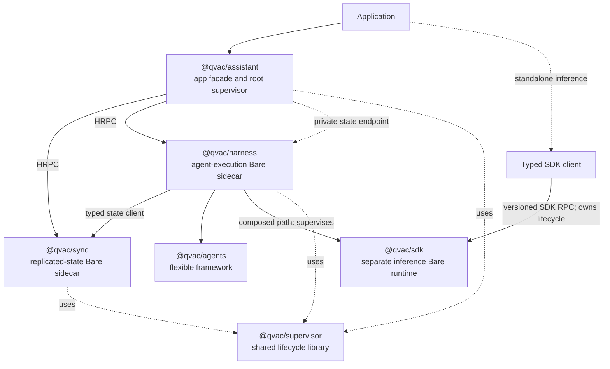

# QIP: Composable Agent Runtime - Decision Brief

This is the shorter approver-facing version of [Composable Agent Runtime](agentic-sdk-p2p-layering.md). It focuses on the product promise, package and runtime boundaries, and migration direction. Detailed evidence and implementation analysis stay in the full QIP.

## Approvers

| Role | Approver | Status |
| --- | --- | --- |
| Lead / Architect | @Dima / @Yury Samarin | |
| Head of QVAC | @Marco | |
| CTO | @Mathias Buus | |

## Why

QVAC should be plug-and-play at the top and composable underneath.

An application should install `@qvac/assistant`, call one lifecycle, and get local agent execution plus durable multi-device state. Developers can still use Harness, Agents, SDK, or Sync directly. Workers, Corestores, HRPC, schemas, storage paths, and runtime versions stay behind the normal API.

The PoC confirms the desktop package boundaries, generated contracts, replicated state, automatic child recovery, and real Qwen task execution between desktop and physical iOS and Android devices. Separate Bare runtimes for Sync, Harness, and SDK are decided in [ADR 0004](../adrs/0004-separate-bare-runtimes-for-sync-harness-and-sdk.md). Android now contains SDK native abort in a private Service process and restarts the lightweight SDK probe while the host and sibling runtimes survive. Real model-loaded Android isolation remains a hard gate. iOS crash containment requires a separate PoC before selecting a process-boundary mechanism.

## What

The target has six components. Runtime topology is
[ADR 0004](../adrs/0004-separate-bare-runtimes-for-sync-harness-and-sdk.md):
three separately supervised Bare runtimes.



Harness owns the SDK runtime in the composed path; the SDK client owns it when an application uses SDK directly.

- **Assistant** owns the application API, defaults, pairing, compatibility, and root lifecycle.
- **Sync** owns identity, P2P networking, replicated state, invites, and durable routing data.
- **Harness** owns ready-to-run agent execution, persistence selection, and SDK supervision.
- **Agents** owns transport-free tools, guards, workflows, approvals, events, and checkpoints.
- **SDK** owns local inference, addons, models, downloads, and standalone worker behavior.
- **Supervisor** owns reusable dependency-aware lifecycle and restart mechanics.

Dependencies remain one-way: Sync has no agent or inference logic; SDK has no mesh or durable delegation logic; Agents owns no runtime or storage; Harness does not depend on Assistant; Supervisor has no product semantics. Sync, Harness, and SDK each own one concise declarative source for their wire contract, runtime information, protocol version, errors, and compatibility tests. Codecs, clients, handler types, bindings, and capability metadata are generated from that source. Callers negotiate the package contracts they compose; no shared runtime-contract package is required.

## Developer experience

An illustrative normal shape is:

```ts
import { createAssistant } from "@qvac/assistant"

const assistant = createAssistant()

await assistant.state.ready()
const identity = await assistant.state.getIdentity()

await assistant.ready()

const run = assistant.run({
  model,
  messages: [{ role: "user", content: "Implement the change" }]
})

for await (const event of run) {
  render(event)
}

await assistant.close()
```

Assistant exposes three independent readiness gates. State readiness makes local Sync state and stable device identity available without Harness, SDK, models, peers, or network connectivity. `assistant.ready()` means Harness is compatible and connected to state, while SDK and model loading remain lazy. Model readiness is keyed by model; `run()` waits for execution and loads its requested model, while an optional preparation call may warm that path.

Concurrent readiness calls share one attempt, replacement runtimes create a new readiness generation, and model failure does not make local state unavailable. Active watches and interrupted inference are not silently replayed after runtime failure. Direct Harness use defaults to in-memory state.

## Runtime behavior

- Assistant root-supervises Sync and Harness. Sync supervises its local
  metadata, identity Corestore, and replicated mesh/network, while Harness
  supervises its lazy SDK runtime.
- Desktop tests prove real child-death detection, dependent reconstruction, and current SDK worker recovery.
- The PoC uses the merged Workbench Supervisor implementation with bounded
  restart, backoff, reconciliation, reload, nesting, and terminal escalation.
- Components own process and HRPC adapters; Supervisor owns generic ordering, restart, suspension, and escalation.
- Replay, checkpoints, claims, fencing, and tool idempotency remain domain policy, not Supervisor behavior.
- Typed contracts fail closed on incompatible required capabilities.
- Logging, coded error envelopes, and one trace ID cross the demonstrated Assistant to Harness to SDK path.

Runtime topology follows
[ADR 0004](../adrs/0004-separate-bare-runtimes-for-sync-harness-and-sdk.md).
Physical iOS and Android prove three concurrent Worklets and suspend/resume.
Android additionally proves real Sync writer admission, a desktop-Qwen task
round trip, background retention, force-stop reconnect, and SDK abort
containment in `:qvac_sdk` for a lightweight probe (not real inference). iOS
Worklets remain in the application process; an Enhanced Security helper
extension is the leading candidate pending the Phase 0 containment PoC.

## State and delegation

Agents ingests transportable state and emits events and checkpoints. Harness chooses in-memory state for direct local use or Sync-backed durable state when composed by Assistant.

Delegation becomes durable task routing through Sync, not an inference RPC proxy. A paired Harness claims replicated work, executes through its own SDK runtime, and commits progress, approvals, checkpoints, and results. Live streams are overlays, not the source of truth. SDK `delegate` and `provide` retire only after an approved migration.

Remote execution remains duplicate-possible until Phase 0 defines leases, fencing, stale reclaim, cancellation, and effect-level idempotency.

## What the proof of concept does and does not prove

**Demonstrated:** generated package contracts, independent desktop runtimes, Sync replication and writer admission, local Harness without Sync, automatic Sync/Harness reconstruction, SDK worker recovery, default storage/model/run IDs, logging/errors/tracing, physical iOS and Android task completion by desktop Qwen, Android background retention, durable Android relaunch, Android SDK-process abort containment plus restart for the lightweight probe, and one application-owned config file that selects inference capabilities and GPU backends through Assistant into the SDK bundle and native link step ([ADR 0005](../adrs/0005-application-owned-assistant-config.md): 461.0 MB → 138.6 MB Android release APK for a completion-only, CPU-only app).

**Not demonstrated:** production package extraction, claim guarantees, safe interrupted-run replay, selective visibility and execution authorization, real model-loaded Android crash isolation, iOS crash isolation, accepted mobile resource budgets, complete host lifecycle policy, production checkpoint compatibility, and a device run of a GPU-backend-pruned build (a CPU-only APK has not yet been shown to load a model on hardware).

## Phase 0 feasibility and decision gates

Phase 0 must turn the current assumptions into evidence and approved contracts before package extraction:

| Gate | Required evidence/decision |
| --- | --- |
| Mobile topology and P9 | Validate model-loaded Android isolation; run a separate iOS containment PoC and return the mechanism choice to approvers ([ADR 0004](../adrs/0004-separate-bare-runtimes-for-sync-harness-and-sdk.md)); approve measured startup, memory, and binary-size budgets. |
| Trust and claims | Approve selective visibility, capabilities, revocation/key epochs, lease/fencing semantics, duplicate handling, and tool idempotency. |
| SDK and host recovery | Prove standalone SDK recovery plus offline, disconnect, background, kill, and relaunch behavior for every supported host. |
| Contract ownership | Keep one concise RPC contract source in each owning package; generate schemas, clients, handler types, bindings, and capability metadata; keep persistence schemas separate and compatibility decisions explicit. |
| Delegation migration | Inventory consumers and approve parity, deprecation duration, migration guidance, and the removal version. |

## Migration shape

After Phase 0 gates, extract Supervisor, then Sync and Agents, build Harness from Agents plus SDK, compose Assistant as the root facade, and finally migrate consumers before removing SDK delegation. Every step must leave Assistant and standalone SDK shippable.

## Consequences

The upside is one easy entry point, state and identity available before inference, and independently reusable layers for agent frameworks, execution, inference, P2P state, and supervision. Topology cost is recorded in [ADR 0004](../adrs/0004-separate-bare-runtimes-for-sync-harness-and-sdk.md); this QIP additionally costs a sixth package, stricter release discipline, and unresolved distributed-execution guarantees.

The approval ask is to adopt the package ownership, ADR 0004 topology, developer-experience promise, and gated migration direction. Mobile crash containment remains an explicit approval gate, not a proven property.

## Out of scope

- Hosted inference APIs, RAG/knowledge replication, attachment/retention/cache policy, vendor graph DSLs, shared Sync/SDK storage, and replacing direct standalone SDK inference.
